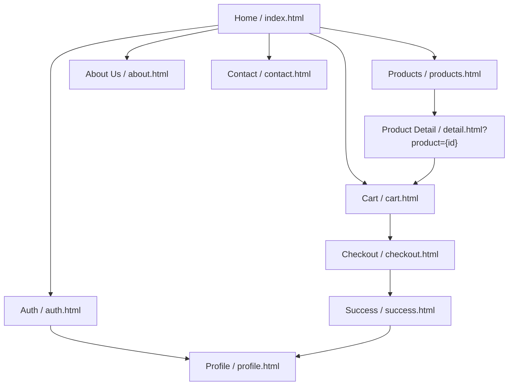
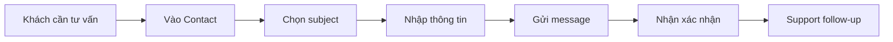
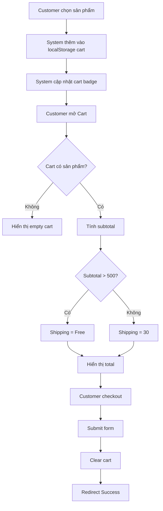
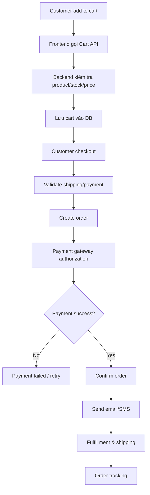
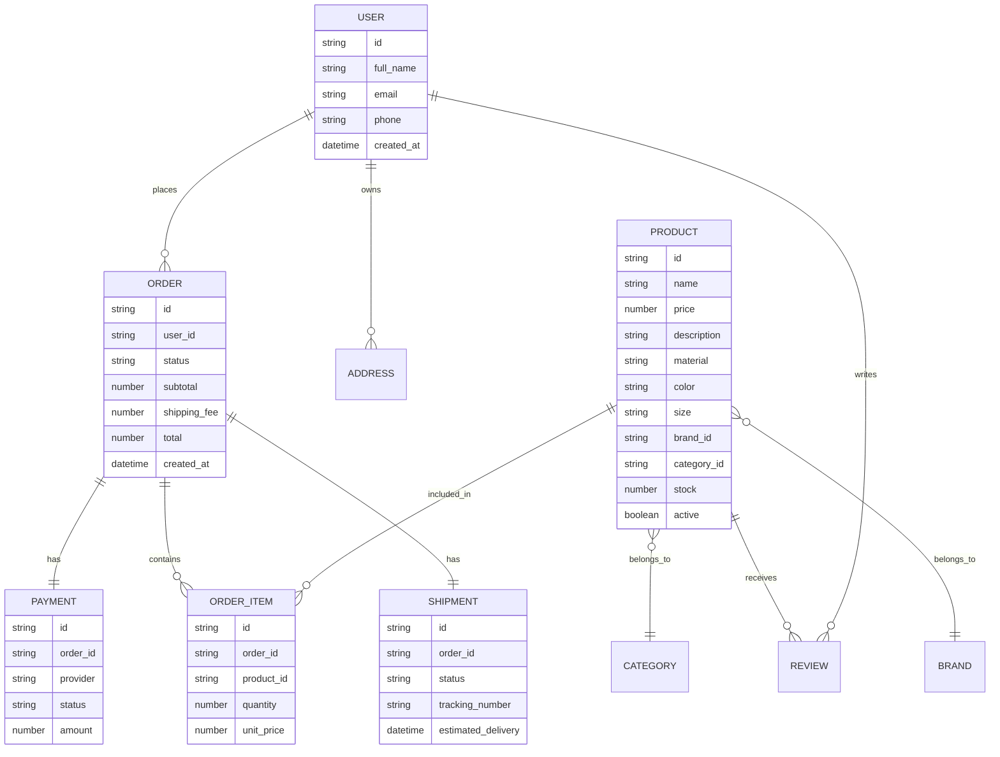

# Tài Liệu Business Analysis Chuyên Nghiệp - LuxRoom

**Dự án:** LuxRoom - Luxury Minimalist Furniture E-commerce  
**Loại tài liệu:** Business Analysis Documentation / Product Business Specification  
**Phiên bản:** 1.0  
**Ngày lập:** 25/05/2026  
**Phạm vi phân tích:** Website thương mại điện tử nội thất cao cấp dựa trên prototype hiện tại trong repo LuxRoom  
**Ngôn ngữ:** Tiếng Việt  

---

## 1. Executive Summary

LuxRoom là một nền tảng thương mại điện tử dành cho phân khúc nội thất luxury-minimal, tập trung vào trải nghiệm khám phá sản phẩm, cảm hứng phong cách sống, thông tin sản phẩm trực quan, giỏ hàng, checkout, tài khoản khách hàng và chăm sóc sau mua.

Mục tiêu của dự án không chỉ là tạo một website bán nội thất, mà là xây dựng một trải nghiệm mua sắm có tính thẩm mỹ, đáng tin cậy và có khả năng giảm do dự khi mua các sản phẩm giá trị cao. Trong bối cảnh thị trường nội thất online đang gặp nhiều rào cản như khách khó hình dung sản phẩm trong không gian thật, thông tin sản phẩm thiếu nhất quán, chi phí vận chuyển/đổi trả cao và quy trình mua hàng còn rời rạc, LuxRoom định vị mình như một storefront tối giản, cao cấp, dễ quét thông tin và giúp người dùng đi từ cảm hứng đến đặt hàng nhanh hơn.

Prototype hiện tại là frontend tĩnh, sử dụng HTML/CSS/JavaScript thuần, lưu giỏ hàng bằng `localStorage`, có dữ liệu sản phẩm mẫu và các luồng mô phỏng. Tài liệu này vừa phản ánh đúng hiện trạng sản phẩm hiện có, vừa đề xuất yêu cầu nghiệp vụ cần có nếu phát triển LuxRoom thành sản phẩm production.

---

## 2. Lý Do Làm Project

### 2.1. Lý do kinh doanh

Thị trường nội thất online có tiềm năng lớn vì người dùng ngày càng quen với việc tìm cảm hứng, so sánh mẫu mã và mua sắm qua kênh số. Tuy nhiên, nội thất là nhóm sản phẩm có giá trị cao, kích thước lớn, phụ thuộc mạnh vào cảm nhận thẩm mỹ, chất liệu, màu sắc và độ phù hợp với không gian sống. Vì vậy, một website nội thất không thể chỉ hiển thị danh sách sản phẩm giống các ngành hàng phổ thông.

LuxRoom được thực hiện để giải quyết nhu cầu xây dựng một trải nghiệm mua sắm nội thất có tính tuyển chọn, cao cấp và giàu cảm xúc hơn. Website cần giúp khách hàng hiểu phong cách thương hiệu, khám phá bộ sưu tập, xem chi tiết sản phẩm, tin tưởng vào thông tin, thêm vào giỏ hàng và hoàn tất đặt hàng trong một hành trình rõ ràng.

### 2.2. Lý do sản phẩm

Các website nội thất cùng thị trường thường mắc một trong ba vấn đề: quá nặng về hình ảnh nhưng thiếu thông tin mua hàng, quá nặng về danh mục nhưng thiếu cảm hứng, hoặc có checkout nhưng thiếu trải nghiệm thương hiệu. LuxRoom chọn hướng cân bằng: vừa có storytelling và visual lifestyle, vừa có các chức năng e-commerce nền tảng.

### 2.3. Lý do kỹ thuật và portfolio

Project cũng là một prototype frontend có thể dùng để thể hiện năng lực thiết kế giao diện, tổ chức design system, phân tích luồng người dùng và chuyển đổi từ mockup sang sản phẩm web. Repo hiện có cấu trúc rõ gồm `src`, `css`, `js`, `img`, `public/assets`, `screenshots` và `docs`, phù hợp để phát triển tiếp thành full-stack e-commerce.

---

## 3. Bối Cảnh Thị Trường Và Vấn Đề Của Sản Phẩm Cùng Ngành

### 3.1. Thị trường mục tiêu

LuxRoom thuộc nhóm **online furniture / home living e-commerce**, tập trung vào khách hàng quan tâm đến nội thất cao cấp, phong cách tối giản, thiết kế bền vững và trải nghiệm mua sắm có gu.

Các sản phẩm cạnh tranh có thể bao gồm:

- Website bán nội thất cao cấp.
- Marketplace nội thất và đồ gia dụng.
- Brand D2C bán sofa, bàn, ghế, giường, lighting, decor.
- Showroom truyền thống mở rộng sang kênh online.
- Nền tảng bán sản phẩm lifestyle/home decor.

### 3.2. Vấn đề lớn của thị trường hiện nay

**1. Khách hàng khó hình dung sản phẩm trong không gian thật**  
Nội thất là sản phẩm có kích thước lớn, phụ thuộc vào màu sắc, chất liệu, ánh sáng và tỷ lệ trong phòng. Ảnh tĩnh thường chưa đủ để khách tự tin rằng sofa, bàn, ghế hoặc đèn sẽ phù hợp với nhà của họ.

**2. Khoảng cách giữa kỳ vọng và sản phẩm nhận được**  
Khách hàng có thể thất vọng khi màu, texture, tỷ lệ, độ mềm, chất liệu hoặc độ hoàn thiện khác với cảm nhận từ website. Đây là nguyên nhân làm tăng đổi trả và giảm niềm tin.

**3. Giao hàng, đổi trả và xử lý hàng cồng kềnh phức tạp**  
Nội thất có chi phí logistics cao hơn nhiều ngành hàng khác. Giao hàng trễ, hư hại khi vận chuyển, phí ship không rõ hoặc quy trình trả hàng phức tạp có thể làm khách bỏ giỏ hàng.

**4. Website thiếu khả năng lọc/tìm kiếm đúng nhu cầu**  
Khách mua nội thất thường cần lọc theo category, subcategory, giá, kích thước, chất liệu, màu, thương hiệu, phòng sử dụng và phong cách. Nếu bộ lọc nghèo nàn, khách mất thời gian và rời trang.

**5. Thông tin sản phẩm chưa đủ sâu**  
Nhiều website chỉ có ảnh, tên và giá, thiếu thông số, chất liệu, kích thước, chính sách vận chuyển, bảo hành, tài liệu đính kèm và đánh giá thực tế.

**6. Trải nghiệm checkout thiếu niềm tin**  
Với đơn hàng giá trị cao, khách cần thấy rõ tổng tiền, phí vận chuyển, thông tin giao hàng, phương thức thanh toán và xác nhận đơn hàng. Nếu checkout rời rạc hoặc thiếu minh bạch, tỷ lệ chuyển đổi giảm.

**7. Thiếu chăm sóc sau mua**  
Người mua nội thất thường cần theo dõi đơn, xem lịch sử mua, tải hóa đơn, liên hệ hỗ trợ, đổi địa chỉ hoặc hỏi về bảo hành. Nếu sau mua không rõ ràng, thương hiệu khó tạo lòng trung thành.

### 3.3. Xu hướng liên quan

- Product visualization, 3D/AR và ảnh sản phẩm chất lượng cao ngày càng quan trọng trong ngành nội thất.
- Khách hàng kỳ vọng trải nghiệm omnichannel: xem online, hỏi tư vấn, nhận hỗ trợ, theo dõi giao hàng.
- Chính sách vận chuyển, đổi trả, bảo hành và thông tin chi tiết sản phẩm trở thành yếu tố niềm tin.
- Nội dung thương hiệu, câu chuyện thiết kế và tính bền vững ảnh hưởng mạnh đến phân khúc cao cấp.

---

## 4. Product Vision

LuxRoom trở thành storefront nội thất cao cấp giúp khách hàng khám phá, đánh giá và mua các sản phẩm luxury-minimal một cách tự tin, thẩm mỹ và liền mạch.

Tầm nhìn sản phẩm:

- Biến website thành một showroom số có cảm giác cao cấp.
- Giảm do dự khi mua sản phẩm nội thất online.
- Rút ngắn hành trình từ khám phá đến checkout.
- Tăng niềm tin bằng nội dung sản phẩm, review, chính sách rõ ràng và trải nghiệm sau mua.
- Là nền tảng có thể mở rộng sang backend, quản trị sản phẩm, đơn hàng, thanh toán thật và vận chuyển.

---

## 5. Mục Tiêu Dự Án

### 5.1. Business Goals

| Mã | Mục tiêu | Ý nghĩa |
|---|---|---|
| BG-01 | Tăng khả năng chuyển đổi từ xem sản phẩm sang thêm giỏ hàng | Chứng minh giá trị của trải nghiệm sản phẩm |
| BG-02 | Tăng độ tin cậy khi mua nội thất online | Giảm lo ngại về chất lượng, vận chuyển và thanh toán |
| BG-03 | Xây dựng nhận diện thương hiệu luxury-minimal | Khác biệt với marketplace đại trà |
| BG-04 | Tạo nền tảng mở rộng thành e-commerce production | Có thể nối backend, payment gateway, quản lý đơn hàng |
| BG-05 | Thu thập lead và tăng retention | Newsletter, account, order history, contact support |

### 5.2. Product Goals

| Mã | Mục tiêu | Biểu hiện trong prototype |
|---|---|---|
| PG-01 | Cho phép khách khám phá bộ sưu tập | Home, category, brand section, product listing |
| PG-02 | Cho phép khách xem chi tiết sản phẩm | Product detail, gallery, description, specs, reviews |
| PG-03 | Cho phép thao tác giỏ hàng | Add to cart, cart count, update quantity, remove item |
| PG-04 | Cho phép checkout mô phỏng | Shipping form, payment form, order summary, success page |
| PG-05 | Cho phép quản lý tài khoản cơ bản | Auth mock, profile, order history |
| PG-06 | Cho phép liên hệ và nhận tư vấn | Contact form, contact info, footer, newsletter |

---

## 6. Phạm Vi Dự Án

### 6.1. In Scope hiện tại

- Trang Home.
- Trang Product Listing.
- Trang Product Detail.
- Global search overlay dạng UI.
- Category và brand interaction trên Home.
- Filter UI theo category, subcategory, price.
- Product grid có pagination.
- Add to cart.
- Cart count toàn site.
- Cart page với tăng/giảm số lượng, xóa sản phẩm, tính subtotal/shipping/total.
- Checkout page với shipping information, payment details, order summary.
- Success page sau khi đặt hàng.
- Auth page mô phỏng đăng nhập/đăng ký.
- Profile page với order history.
- Contact page với form liên hệ.
- Newsletter form UI.
- Design system tokens cho màu, typography, spacing, radius, shadows, buttons, forms, cards.

### 6.2. Out of Scope hiện tại

- Backend thật.
- Database thật.
- Authentication thật.
- Payment gateway thật.
- Tìm kiếm sản phẩm thật theo từ khóa.
- Lọc/sort sản phẩm thật theo dữ liệu.
- Quản trị sản phẩm/đơn hàng.
- Tồn kho, kho vận, tracking giao hàng.
- Mã giảm giá xử lý thật.
- Email confirmation.
- Review submission thật.
- AR/3D visualization.

### 6.3. Đề xuất Scope khi phát triển production

- Backend API cho product, cart, order, user, payment, review.
- Database cho sản phẩm, khách hàng, giỏ hàng, đơn hàng, thanh toán, vận chuyển.
- Payment integration.
- Search/filter/sort thật.
- Admin CMS.
- Order tracking.
- Inventory management.
- Email/SMS notification.
- Loyalty hoặc membership.
- Recommendation engine.
- 3D/AR preview cho sản phẩm có giá trị cao.

---

## 7. Stakeholder Analysis

| Stakeholder | Vai trò | Nhu cầu chính | Mức ảnh hưởng |
|---|---|---|---|
| Business Owner | Chủ dự án/thương hiệu | Tăng doanh số, định vị thương hiệu, kiểm soát chi phí | Cao |
| Product Owner | Quản lý định hướng sản phẩm | Ưu tiên backlog, đảm bảo sản phẩm đúng mục tiêu | Cao |
| Business Analyst | Phân tích nghiệp vụ | Làm rõ vấn đề, scope, requirement, luồng, rule | Cao |
| UX/UI Designer | Thiết kế trải nghiệm | Tạo giao diện cao cấp, dễ dùng, đúng brand | Cao |
| Frontend Developer | Xây dựng giao diện | Implement HTML/CSS/JS, responsive, tương tác | Cao |
| Backend Developer | Phát triển hệ thống | API, database, auth, order, payment | Trung bình/Cao |
| QA Tester | Kiểm thử | Test luồng mua hàng, form, cart, checkout | Trung bình |
| Customer Support | Hỗ trợ khách | Tiếp nhận câu hỏi, đổi trả, tracking, khiếu nại | Trung bình |
| Marketing Team | Tăng traffic/lead | Landing content, newsletter, campaign, analytics | Trung bình |
| End Customer | Người mua | Tìm sản phẩm đẹp, tin tưởng, mua nhanh, nhận hàng đúng | Cao |

---

## 8. Persona Người Dùng

### Persona 1: Urban Home Styler

| Thuộc tính | Mô tả |
|---|---|
| Hồ sơ | 25-38 tuổi, sống ở đô thị, quan tâm thẩm mỹ nhà ở |
| Mục tiêu | Tìm nội thất đẹp, phù hợp căn hộ, có phong cách riêng |
| Nỗi đau | Khó hình dung sản phẩm trong phòng, sợ lệch màu/chất liệu |
| Kỳ vọng | Ảnh đẹp, thông tin rõ, lọc nhanh, checkout đơn giản |

### Persona 2: Premium Buyer

| Thuộc tính | Mô tả |
|---|---|
| Hồ sơ | Thu nhập khá/cao, ưu tiên chất lượng và thương hiệu |
| Mục tiêu | Mua sản phẩm bền, sang, ít lỗi thời |
| Nỗi đau | Không tin website thiếu thông tin bảo hành/giao hàng |
| Kỳ vọng | Review, thông số, chính sách rõ, hỗ trợ nhanh |

### Persona 3: Interior Consultant

| Thuộc tính | Mô tả |
|---|---|
| Hồ sơ | Nhà thiết kế nội thất hoặc người mua cho dự án |
| Mục tiêu | Tìm sản phẩm theo phong cách, brand, budget |
| Nỗi đau | Thiếu tài liệu sản phẩm, thiếu thông tin kỹ thuật |
| Kỳ vọng | Catalog rõ, thông số, tài liệu đính kèm, liên hệ tư vấn |

---

## 9. Project Này Đã Giải Quyết Được Những Gì

| Vấn đề thị trường | Cách LuxRoom hiện tại giải quyết | Mức độ |
|---|---|---|
| Thiếu cảm hứng khi mua nội thất online | Home có hero, storytelling, category, brand, lifestyle visuals | Tốt ở prototype |
| Khách khó khám phá danh mục | Product listing có filter UI, category/subcategory, price slider, pagination | Trung bình, cần logic lọc thật |
| Thiếu thông tin sản phẩm | Detail page có gallery, mô tả, màu, chân ghế, size, specs, documents, reviews | Tốt ở UI, cần dữ liệu thật |
| Khó thêm và quản lý giỏ hàng | Add to cart, cart count, cart page, update quantity, remove item | Tốt ở frontend |
| Checkout không rõ tổng tiền | Checkout/cart có order summary, subtotal, shipping, total | Tốt ở prototype |
| Thiếu trạng thái sau đặt hàng | Success page và profile order history | Cơ bản |
| Thiếu liên hệ hỗ trợ | Contact page, footer info, customer service links | Cơ bản |
| Thiếu nhận diện thương hiệu | Design system luxury-minimal, typography display, palette trắng/đen/tối giản | Tốt |
| Thiếu retention/lead capture | Newsletter form trên Home/Product/About | Cơ bản |

---

## 10. Current Product Inventory

### 10.1. Sitemap hiện tại

### 10.2. Trang và chức năng

| Trang | Mục đích | Chức năng chính |
|---|---|---|
| Home | Tạo cảm hứng và dẫn vào collection | Hero, Who We Are, category tabs, brand tabs, core values, newsletter |
| Products | Duyệt sản phẩm | Product grid, filter UI, price slider, pagination, add to cart |
| Detail | Xem chi tiết sản phẩm | Gallery, description, options, quantity, add to cart, specs, reviews |
| Cart | Quản lý giỏ hàng | Danh sách item, tăng/giảm số lượng, xóa, subtotal, shipping, total |
| Checkout | Nhập giao hàng và thanh toán | Shipping form, payment form, order summary, place order |
| Success | Xác nhận đơn | Order ID mock, continue shopping, view order history |
| Auth | Đăng nhập/đăng ký mô phỏng | Tab login/register, redirect profile |
| Profile | Tài khoản | Order history, status delivered/processing, invoice link mock |
| Contact | Hỗ trợ | Contact info, form, subject selection |

### 10.3. Product catalog mẫu

Prototype có 12 sản phẩm mẫu trong `js/common.js`, gồm sofa, bed, console, bathtub, desk, chair, rug, panel, table. Giá dao động từ `$180` đến `$900`. Dữ liệu hiện tại đủ để demo listing, detail, add-to-cart và checkout, nhưng chưa đủ để vận hành e-commerce thật.

---

## 11. User Journey

### 11.1. Hành trình mua hàng tiêu chuẩn

```mermaid
flowchart LR
    A["Vào Home"] --> B["Xem category/brand"]
    B --> C["Mở Product Listing"]
    C --> D["Dùng filter/price range"]
    D --> E["Xem Product Detail"]
    E --> F["Chọn số lượng"]
    F --> G["Add to Cart"]
    G --> H["Kiểm tra Cart"]
    H --> I["Checkout"]
    I --> J["Nhập shipping/payment"]
    J --> K["Place Order"]
    K --> L["Success"]
    L --> M["Profile/Order History"]
```

### 11.2. Hành trình liên hệ tư vấn

---

## 12. Business Process

### 12.1. Quy trình mua hàng ở prototype

### 12.2. Quy trình production đề xuất

---

## 13. Functional Requirements

### 13.1. Product Discovery

| ID | Requirement | Priority | Current status |
|---|---|---|---|
| FR-01 | Người dùng có thể xem landing/Home với hero và CTA đến collection | Must | Có |
| FR-02 | Người dùng có thể xem category theo Furniture, Accessories, Lighting, Outdoor | Must | Có UI |
| FR-03 | Người dùng có thể xem sản phẩm theo brand | Should | Có UI trên Home |
| FR-04 | Người dùng có thể mở danh sách sản phẩm | Must | Có |
| FR-05 | Người dùng có thể phân trang danh sách sản phẩm | Should | Có |
| FR-06 | Người dùng có thể lọc theo category, subcategory, price | Must | Có UI, chưa lọc thật |
| FR-07 | Người dùng có thể sort sản phẩm | Should | Có UI, chưa logic |
| FR-08 | Người dùng có thể tìm kiếm sản phẩm | Must | Có overlay UI, chưa search thật |

### 13.2. Product Detail

| ID | Requirement | Priority | Current status |
|---|---|---|---|
| FR-09 | Người dùng có thể xem gallery sản phẩm | Must | Có |
| FR-10 | Người dùng có thể xem tên, giá, brand, mô tả | Must | Có |
| FR-11 | Người dùng có thể xem màu, finish, size | Should | Có static |
| FR-12 | Người dùng có thể xem specifications | Must | Có accordion |
| FR-13 | Người dùng có thể xem attached documents | Could | Có UI |
| FR-14 | Người dùng có thể xem review/rating | Should | Có static |
| FR-15 | Người dùng có thể chọn số lượng | Must | Có |
| FR-16 | Người dùng có thể thêm sản phẩm vào giỏ | Must | Có |

### 13.3. Cart

| ID | Requirement | Priority | Current status |
|---|---|---|---|
| FR-17 | Hệ thống hiển thị số lượng item trong cart badge | Must | Có |
| FR-18 | Người dùng có thể xem danh sách item trong cart | Must | Có |
| FR-19 | Người dùng có thể tăng/giảm số lượng | Must | Có |
| FR-20 | Người dùng có thể xóa item | Must | Có |
| FR-21 | Hệ thống tính subtotal | Must | Có |
| FR-22 | Hệ thống tính shipping | Must | Có, rule đơn giản |
| FR-23 | Hệ thống tính total | Must | Có |
| FR-24 | Người dùng có thể tiếp tục mua hàng | Should | Có |

### 13.4. Checkout & Order

| ID | Requirement | Priority | Current status |
|---|---|---|---|
| FR-25 | Người dùng nhập shipping information | Must | Có form |
| FR-26 | Người dùng nhập payment details | Must | Có form |
| FR-27 | Hệ thống validate required fields | Must | Có HTML validation |
| FR-28 | Hệ thống hiển thị order summary | Must | Có |
| FR-29 | Hệ thống tạo order sau thanh toán | Must | Mô phỏng |
| FR-30 | Hệ thống hiển thị success page | Must | Có |
| FR-31 | Hệ thống gửi email xác nhận | Should | Chưa có |
| FR-32 | Hệ thống lưu order history | Must | Static mock |

### 13.5. Account & Support

| ID | Requirement | Priority | Current status |
|---|---|---|---|
| FR-33 | Người dùng có thể đăng nhập | Must | Mô phỏng |
| FR-34 | Người dùng có thể đăng ký | Must | Mô phỏng |
| FR-35 | Người dùng có thể xem profile | Should | Có |
| FR-36 | Người dùng có thể xem order history | Must | Có static |
| FR-37 | Người dùng có thể xem invoice | Could | Link mock |
| FR-38 | Người dùng có thể gửi contact form | Should | Có alert |
| FR-39 | Người dùng có thể đăng ký newsletter | Should | Có UI |

---

## 14. Non-Functional Requirements

| ID | Nhóm | Requirement | Tiêu chí đề xuất |
|---|---|---|---|
| NFR-01 | Performance | Trang tải nhanh | LCP dưới 2.5s ở mạng tốt |
| NFR-02 | Responsive | Hỗ trợ desktop/tablet/mobile | Không vỡ layout ở 360px-1440px |
| NFR-03 | Accessibility | Điều hướng bằng keyboard và screen reader | Button/link có label, focus state rõ |
| NFR-04 | Security | Không lưu thông tin thẻ ở frontend | Payment tokenization khi production |
| NFR-05 | Privacy | Bảo vệ dữ liệu cá nhân | Có privacy policy, consent newsletter |
| NFR-06 | Reliability | Cart không mất khi refresh | Hiện có localStorage, production cần DB/session |
| NFR-07 | Maintainability | CSS/JS dễ mở rộng | Dùng design system tokens và module page CSS |
| NFR-08 | SEO | Trang sản phẩm index tốt | Metadata, schema Product, URL thân thiện |
| NFR-09 | Analytics | Đo được funnel | Track view product, add cart, checkout, purchase |
| NFR-10 | Scalability | Mở rộng catalog | API/data model hỗ trợ nhiều SKU/category |

---

## 15. Business Rules

| ID | Rule | Hiện trạng / Đề xuất |
|---|---|---|
| BR-01 | Cart item quantity tối thiểu là 1 | Hiện có ở detail/cart |
| BR-02 | Nếu quantity về 0 thì item bị xóa khỏi cart | Hiện có |
| BR-03 | Shipping miễn phí khi subtotal > 500 | Hiện có trong cart/checkout |
| BR-04 | Checkout không cho tiếp tục nếu cart rỗng | Hiện có redirect ở checkout |
| BR-05 | Payment form phải đủ required fields | Có HTML validation |
| BR-06 | Sau khi order thành công, cart được clear | Hiện có |
| BR-07 | Product price tại checkout phải lấy từ server | Đề xuất production |
| BR-08 | Order chỉ được tạo khi payment authorized | Đề xuất production |
| BR-09 | User có thể checkout với guest hoặc account | Đề xuất |
| BR-10 | Return/exchange phải phụ thuộc trạng thái fulfillment | Đề xuất |

---

## 16. Data Model Đề Xuất

---

## 17. API Requirements Đề Xuất

| Method | Endpoint | Mục đích |
|---|---|---|
| GET | `/api/products` | Lấy danh sách sản phẩm, hỗ trợ filter/sort/pagination |
| GET | `/api/products/{id}` | Lấy chi tiết sản phẩm |
| GET | `/api/categories` | Lấy category/subcategory |
| GET | `/api/brands` | Lấy danh sách brand |
| POST | `/api/cart/items` | Thêm sản phẩm vào giỏ |
| PATCH | `/api/cart/items/{id}` | Cập nhật số lượng |
| DELETE | `/api/cart/items/{id}` | Xóa item |
| GET | `/api/cart` | Lấy giỏ hàng hiện tại |
| POST | `/api/checkout` | Tạo phiên checkout |
| POST | `/api/orders` | Tạo đơn hàng |
| GET | `/api/orders` | Lấy order history |
| GET | `/api/orders/{id}` | Lấy chi tiết đơn |
| POST | `/api/auth/login` | Đăng nhập |
| POST | `/api/auth/register` | Đăng ký |
| POST | `/api/contact` | Gửi form liên hệ |
| POST | `/api/newsletter/subscribe` | Đăng ký newsletter |

---

## 18. Use Case Summary

| Actor | Use Case | Mục tiêu |
|---|---|---|
| Guest | Browse Home | Hiểu thương hiệu và đi vào collection |
| Guest | Search Product | Tìm nhanh sản phẩm |
| Guest | Filter Products | Thu hẹp danh sách theo nhu cầu |
| Guest | View Product Detail | Đánh giá sản phẩm trước khi mua |
| Guest | Add to Cart | Lưu sản phẩm muốn mua |
| Guest | Manage Cart | Điều chỉnh đơn hàng |
| Guest | Checkout | Hoàn tất mua hàng |
| Guest | Register/Login | Tạo hoặc truy cập tài khoản |
| Customer | View Order History | Theo dõi đơn đã mua |
| Customer | View Invoice | Xem chứng từ đơn hàng |
| Customer | Contact Support | Gửi yêu cầu tư vấn/hỗ trợ |
| Admin | Manage Product | Quản lý catalog |
| Admin | Manage Order | Xử lý đơn hàng |
| Admin | Manage Content | Cập nhật homepage/banner/policy |

---

## 19. Acceptance Criteria Mẫu

### US-01: Add to Cart

**As a** customer,  
**I want** thêm sản phẩm vào giỏ hàng,  
**So that** tôi có thể lưu sản phẩm và thanh toán sau.

Acceptance Criteria:

- Given người dùng đang ở Product Detail, when bấm `Add to Cart`, then sản phẩm được thêm vào cart.
- Given sản phẩm đã có trong cart, when thêm tiếp cùng sản phẩm, then quantity tăng lên.
- Given cart có item, when thêm thành công, then cart badge cập nhật số lượng.
- Given thêm thành công, then hệ thống hiển thị toast xác nhận.

### US-02: Checkout

**As a** customer,  
**I want** nhập thông tin giao hàng và thanh toán,  
**So that** tôi có thể hoàn tất đơn mua nội thất.

Acceptance Criteria:

- Given cart rỗng, when mở checkout, then hệ thống điều hướng về Home hoặc Cart.
- Given cart có item, when mở checkout, then hiển thị order summary chính xác.
- Given thiếu required fields, when submit, then hệ thống chặn submit.
- Given thông tin hợp lệ, when submit, then hệ thống clear cart và chuyển sang success page.

### US-03: Product Filtering

**As a** customer,  
**I want** lọc sản phẩm theo category, subcategory và price,  
**So that** tôi tìm được sản phẩm phù hợp nhanh hơn.

Acceptance Criteria:

- Given người dùng ở Products page, when mở filter, then filter panel hiển thị.
- Given chọn category/subcategory, when apply, then danh sách sản phẩm cập nhật.
- Given thay đổi price range, when apply, then chỉ hiển thị sản phẩm trong khoảng giá.
- Given bấm clear all, then filter trở về mặc định.

---

## 20. KPI Và Measurement Plan

| KPI | Định nghĩa | Công thức / Cách đo |
|---|---|---|
| Product View Rate | Tỷ lệ người vào listing rồi xem detail | Product detail views / Listing visits |
| Add-to-Cart Rate | Tỷ lệ thêm giỏ | Add to cart events / Product detail views |
| Cart-to-Checkout Rate | Tỷ lệ từ cart sang checkout | Checkout starts / Cart visits |
| Checkout Completion Rate | Tỷ lệ hoàn tất đặt hàng | Successful orders / Checkout starts |
| Search Usage Rate | Tỷ lệ dùng search | Search events / Sessions |
| Filter Usage Rate | Tỷ lệ dùng filter | Filter apply events / Listing visits |
| Average Order Value | Giá trị đơn trung bình | Revenue / Orders |
| Cart Abandonment Rate | Tỷ lệ bỏ giỏ | 1 - Orders / Carts created |
| Return Request Rate | Tỷ lệ yêu cầu đổi trả | Return requests / Orders |
| Support Contact Rate | Tỷ lệ cần hỗ trợ | Contact requests / Orders or Sessions |

---

## 21. Gap Analysis

| Nhóm | Hiện trạng | Khoảng trống | Đề xuất |
|---|---|---|---|
| Data | Sản phẩm hard-code trong JS | Không có database/API | Xây product API và CMS |
| Search | Overlay UI static | Không tìm theo keyword | Implement search index |
| Filter | UI có category/price | Chưa lọc dữ liệu thật | Gắn filter với product query |
| Auth | Redirect mock | Không xác thực | JWT/session auth |
| Payment | Form mock | Không thanh toán thật | Tích hợp payment gateway |
| Order | Success/order history static | Không lưu đơn thật | Order service + DB |
| Review | Review static | Không submit/manage review | Review module |
| Logistics | Shipping rule đơn giản | Không có carrier/tracking | Shipping integration |
| Analytics | Chưa thấy tracking | Không đo funnel | GA4/PostHog/Segment |
| Content | Nội dung mẫu còn lỗi chính tả | Chưa chuẩn brand voice | Content QA/copywriting |

---

## 22. Risk Analysis

| Risk | Mức độ | Ảnh hưởng | Mitigation |
|---|---|---|---|
| Khách không tin chất lượng sản phẩm qua ảnh | Cao | Giảm conversion, tăng return | Thêm ảnh chi tiết, video, 3D/AR, review thật |
| Chi phí giao hàng cao làm bỏ giỏ | Cao | Cart abandonment | Hiển thị shipping sớm, threshold freeship, carrier quote |
| Dữ liệu sản phẩm không đủ chi tiết | Trung bình/Cao | Khách do dự | Chuẩn hóa product content template |
| Payment/security không đạt chuẩn | Cao | Rủi ro pháp lý và niềm tin | Không lưu card, dùng gateway đạt chuẩn |
| UI đẹp nhưng thiếu SEO/performance | Trung bình | Traffic organic thấp | SEO metadata, schema, optimize image |
| Không có admin/CMS | Trung bình | Khó vận hành catalog | Xây admin dashboard |
| Không có tracking hành vi | Trung bình | Khó tối ưu | Thiết lập analytics events |

---

## 23. Roadmap Đề Xuất

### Phase 1: Chuẩn hóa MVP frontend

- Sửa copywriting và lỗi chính tả.
- Hoàn thiện responsive và accessibility.
- Gắn filter/search thật trên dữ liệu local.
- Chuẩn hóa product detail theo từng sản phẩm.
- Bổ sung empty/error/loading states.

### Phase 2: Backend e-commerce core

- Product API.
- Cart API.
- Auth/register/login.
- Order API.
- Database schema.
- Admin quản lý product/order.

### Phase 3: Checkout production

- Payment gateway.
- Email confirmation.
- Order tracking.
- Shipping fee calculation.
- Invoice generation.

### Phase 4: Conversion optimization

- Product recommendation.
- Review thật.
- Wishlist.
- Recently viewed.
- Promotion/coupon.
- Analytics funnel dashboard.

### Phase 5: Premium furniture experience

- 360 product view.
- AR/room preview cho sản phẩm chủ lực.
- Material swatches.
- Interior consultation booking.
- B2B/designer account.

---

## 24. MoSCoW Prioritization

### Must Have

- Product listing.
- Product detail.
- Cart.
- Checkout.
- Order confirmation.
- Basic auth/account.
- Contact/support.
- Responsive layout.
- Product data/API.
- Order storage.

### Should Have

- Real filter/search.
- Reviews.
- Newsletter subscription.
- Order history.
- Email confirmation.
- Shipping policy display.
- SEO metadata.
- Analytics events.

### Could Have

- Wishlist.
- Coupon.
- Product comparison.
- Recommendations.
- Designer consultation.
- Invoice download.
- Multi-language.

### Won't Have trong MVP

- Full AR/3D viewer.
- Marketplace multi-seller.
- Complex loyalty system.
- Warehouse optimization.
- AI interior design assistant.

---

## 25. Definition of Done

Một chức năng được xem là hoàn tất khi:

- Requirement đã được PO/BA xác nhận.
- UI khớp design system.
- Có trạng thái default, empty, loading, error nếu phù hợp.
- Responsive trên desktop/tablet/mobile.
- Không có lỗi console nghiêm trọng.
- Có validation cho input quan trọng.
- Có test case QA hoặc checklist test.
- Có analytics event nếu thuộc funnel chính.
- Có tài liệu cập nhật nếu thay đổi nghiệp vụ.

---

## 26. QA Test Scenarios Chính

| ID | Scenario | Expected Result |
|---|---|---|
| TC-01 | Mở Home và click Explore Collection | Điều hướng sang Products |
| TC-02 | Click category tab trên Home | Category items đổi theo tab |
| TC-03 | Mở Products và chuyển page | Product grid cập nhật |
| TC-04 | Add product từ listing | Cart badge tăng |
| TC-05 | Mở detail bằng query product id | Tên/giá đổi theo sản phẩm |
| TC-06 | Tăng quantity rồi add cart | Cart lưu đúng quantity |
| TC-07 | Giảm quantity trong cart | Subtotal/total cập nhật |
| TC-08 | Xóa item khỏi cart | Item biến mất, total cập nhật |
| TC-09 | Checkout với cart rỗng | Redirect theo rule |
| TC-10 | Submit checkout hợp lệ | Clear cart và sang success |
| TC-11 | Login/Register | Redirect profile |
| TC-12 | Submit contact form | Hiển thị confirmation và reset form |

---

## 27. Content & UX Recommendations

### 27.1. Copywriting cần chỉnh

- Thống nhất `LuxRoom` thay vì lúc `Luxroom`.
- Sửa `accessoriess` thành `accessories`.
- Sửa `Lightning` thành `Lighting`.
- Sửa `Vaset` thành `Vases`.
- Thay nội dung `Furniture Bonus 2020` nếu không phù hợp thị trường Việt Nam.
- Chuẩn hóa email/phone/address giữa Contact và Footer.
- Tránh copy review trùng lặp.

### 27.2. Product content template đề xuất

Mỗi sản phẩm nên có:

- Tên sản phẩm.
- Brand.
- Category/subcategory.
- Giá.
- Ảnh hero.
- Ảnh close-up chất liệu.
- Ảnh lifestyle trong không gian thật.
- Kích thước.
- Chất liệu.
- Màu sắc.
- Finish.
- Cân nặng.
- Thời gian giao hàng.
- Chính sách đổi trả.
- Bảo hành.
- Tài liệu đính kèm.
- Review/rating.

### 27.3. UX đề xuất cho ngành nội thất

- Hiển thị shipping estimate sớm tại detail/cart.
- Thêm size guide hoặc hình minh họa kích thước.
- Thêm material swatch.
- Cho phép zoom ảnh.
- Thêm wishlist cho khách chưa sẵn sàng mua.
- Thêm compare cho các sản phẩm cùng loại.
- Thêm delivery/return policy cạnh CTA.
- Thêm trust badges nhưng giữ phong cách tối giản.

---

## 28. Assumptions

- LuxRoom hướng đến phân khúc nội thất cao cấp, không phải marketplace đại trà.
- Prototype hiện tại ưu tiên frontend/UI, chưa đại diện cho kiến trúc backend cuối cùng.
- Các giá và sản phẩm trong repo là dữ liệu mẫu.
- Luồng payment hiện tại chỉ mô phỏng, chưa xử lý giao dịch thật.
- Tài liệu này dùng để định hướng BA/Product cho giai đoạn mở rộng sản phẩm.

---

## 29. Constraints

- Hiện tại không có backend, database hoặc CMS.
- Cart phụ thuộc vào `localStorage`, chỉ lưu trên trình duyệt người dùng.
- Search/filter chưa có logic dữ liệu hoàn chỉnh.
- Một số nội dung/copy còn là placeholder.
- Không có test automation trong repo hiện tại.
- Hình ảnh là asset tĩnh trong `img` và `public/assets`.

---

## 30. Open Questions

| ID | Câu hỏi | Người cần trả lời |
|---|---|---|
| OQ-01 | LuxRoom bán tại Việt Nam, quốc tế hay cả hai? | Business Owner |
| OQ-02 | Có cho guest checkout không? | Product Owner |
| OQ-03 | Payment gateway dự kiến là gì? | Business/Tech |
| OQ-04 | Chính sách freeship chính thức là bao nhiêu? | Business |
| OQ-05 | Có quản lý tồn kho realtime không? | Operations/Tech |
| OQ-06 | Có showroom offline hoặc tư vấn thiết kế không? | Business |
| OQ-07 | Review có cần moderation không? | Product/Support |
| OQ-08 | Có cần đa ngôn ngữ/đa tiền tệ không? | Business |

---

## 31. Traceability Matrix

| Business Goal | Product Goal | Requirement liên quan |
|---|---|---|
| BG-01 Tăng conversion | PG-02, PG-03, PG-04 | FR-09 đến FR-30 |
| BG-02 Tăng niềm tin | PG-02, PG-06 | FR-12, FR-14, FR-38, NFR-04 |
| BG-03 Định vị thương hiệu | PG-01 | FR-01, FR-02, design system |
| BG-04 Mở rộng production | PG-03, PG-04, PG-05 | API, Data Model, NFR-07 |
| BG-05 Retention | PG-05, PG-06 | FR-33 đến FR-39 |

---

## 32. Kết Luận

LuxRoom hiện đã có nền tảng frontend tốt cho một sản phẩm e-commerce nội thất luxury-minimal: giao diện có nhận diện rõ, luồng khám phá và mua hàng cơ bản đầy đủ, có cart/checkout/profile/contact và design system riêng. Điểm mạnh lớn nhất của project là đã tạo được cảm giác showroom số cao cấp thay vì một danh sách sản phẩm khô cứng.

Ở góc nhìn BA, giá trị cốt lõi của LuxRoom nằm ở việc xử lý đúng các friction lớn của ngành nội thất online: tạo cảm hứng, giúp khách hiểu sản phẩm, giảm do dự khi thêm giỏ, minh bạch tổng tiền và duy trì liên hệ sau mua. Để trở thành sản phẩm production, LuxRoom cần phát triển thêm backend, database, search/filter thật, thanh toán thật, quản trị đơn hàng, nội dung sản phẩm chuẩn hóa, analytics và các tính năng tăng niềm tin như review thật, chính sách vận chuyển/đổi trả rõ ràng, material/size guide và có thể là 3D/AR preview.

Tài liệu này có thể dùng làm file BA tổng hợp cho stakeholder, Product Owner, UX/UI, Dev và QA trong giai đoạn phân tích, lập kế hoạch MVP và mở rộng sản phẩm.

---

## 33. Nguồn Tham Khảo

### 33.1. Nguồn nội bộ từ project

- `README.md` - mô tả LuxRoom là luxury-minimal furniture frontend concept.
- `src/index.html` - Home, hero, category, brand, core values, newsletter.
- `src/products.html` và `js/products.js` - listing, filter UI, pagination, add to cart.
- `src/detail.html` và `js/detail.js` - product detail, quantity, specs, reviews.
- `src/cart.html` và `js/cart.js` - cart management, shipping rule, payment mock.
- `src/checkout.html` và `js/checkout.js` - checkout form, order summary, success redirect.
- `src/auth.html`, `src/profile.html`, `src/contact.html` - account/support flows.
- `css/design-system.css` - design tokens và UI guidelines.

### 33.2. Nguồn tham khảo thị trường

- CommerceIQ - 2025 Furniture Ecommerce Performance & Trends Review: https://www.commerceiq.ai/reports/2025-year-in-review-furniture
- Furniture Today - Furniture/home furnishings and e-commerce changes in 2025: https://www.furnituretoday.com/e-commerce/furniture-home-furnishings-contribute-to-e-commerce-slide-in-2025/
- ChannelEngine - Home & Living ecommerce trends shaping 2025: https://www.channelengine.com/en/blog/home-and-living-trends
- Retail Insider - Product presentation and purchase hesitation in furniture/home retail: https://retail-insider.com/articles/2026/03/how-better-product-presentation-helps-furniture-and-home-retailers-reduce-purchase-hesitation-online/
- Zigpoll - Furniture/decor online shopping pain points and ideal digital experience: https://www.zigpoll.com/content/what-are-the-key-pain-points-your-customers-face-when-browsing-furniture-and-dcor-online-and-how-do-you-envision-the-ideal-digital-shopping-experience-to-address-these-challenges
- Cylindo - Reducing furniture returns with product visualization: https://blog.cylindo.com/prevent-furniture-returns-with-3d-product-visualization

