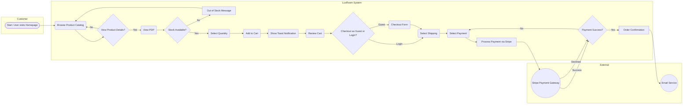
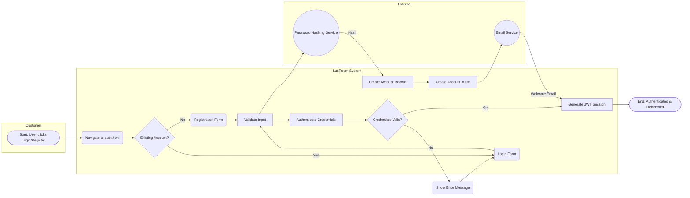
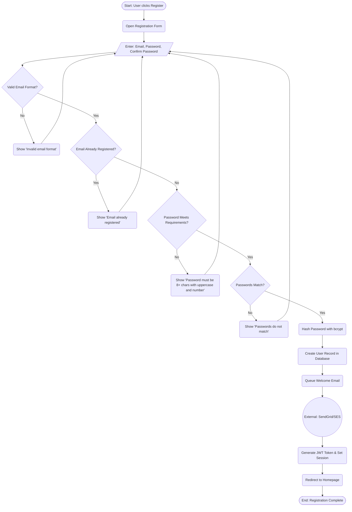
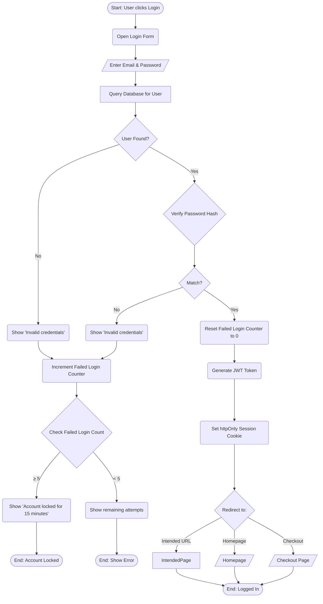
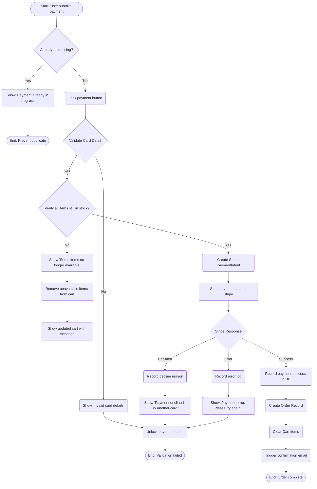
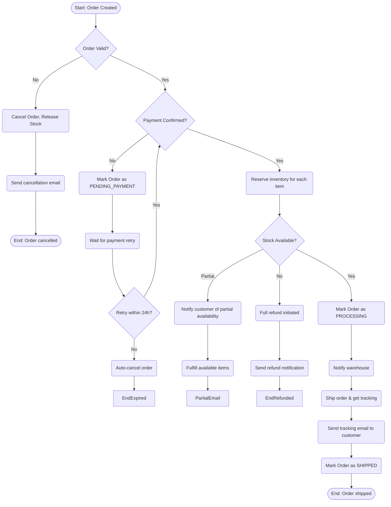

# Business Process Models

**Project:** LuxRoom E-commerce
**Modeling Standard:** BPMN 2.0 (represented via Mermaid Flowcharts)
**Version:** 1.1

These process models illustrate the core user journeys within the LuxRoom platform, including swimlane diagrams for role clarity and comprehensive exception handling.

---

## 1. End-to-End Shopping & Checkout Flow

### 1.1 Swimlane Diagram (User vs System vs External)



### 1.2 Detailed Flow with Exception Handling

```mermaid
flowchart TD
    Start([Start: User visits Homepage/Products]) --> Browse

    Browse(Browse Product Catalog) --> SelectProduct{Selects Product for details?}

    SelectProduct -->|Yes| ViewPDP(View Product Detail Page)
    SelectProduct -->|No| Browse

    ViewPDP --> CheckStock{Item in stock?}

    CheckStock -->|No| OutOfStock(Display 'Out of Stock' & Disable Add Button)
    OutOfStock --> NotifyMe(Show 'Notify Me' Form)
    NotifyMe --> Browse

    CheckStock -->|Yes| SelectQty(Select Quantity & Click 'Add to Cart')

    SelectQty --> ValidateQty{Quantity valid?}
    ValidateQty -->|Exceeds Stock| StockWarning(Show 'Only {n} left' warning)
    StockWarning --> SelectQty

    ValidateQty -->|Valid| AddCart(Add Item to Cart)
    AddCart --> UpdateUI(Update Cart Icon Badge & Show Toast)

    UpdateUI --> Continue{Continue Shopping?}

    Continue -->|Yes| Browse
    Continue -->|No| GoCart(Go to Cart Page)

    GoCart --> ReviewCart(Review Items, Quantities, Subtotal)

    ReviewCart --> AdjustCart{Adjust Cart?}
    AdjustCart -->|Yes| EditCart(Edit Quantities or Remove Items)
    EditCart --> Recalculate(Calculate New Subtotal)
    Recalculate --> ReviewCart
    AdjustCart -->|No| ProceedCheckout

    ProceedCheckout --> CheckAuth{Is User Logged In?}

    CheckAuth -->|Yes| LoadProfile(Load Saved Addresses & Default Info)
    CheckAuth -->|No| GuestChoice{Guest Checkout?}

    GuestChoice -->|No| RedirectLogin(Redirect to Login/Register)
    RedirectLogin --> LoginPage[/Login Form/]
    LoginPage --> Authenticate[Authenticate User]
    Authenticate -->|Success| LoadProfile
    Authenticate -->|Failure| ShowAuthError(Show Error & Retry)
    ShowAuthError --> LoginPage

    GuestChoice -->|Yes| BlankForm(Show Blank Checkout Form)

    LoadProfile --> ShippingForm
    BlankForm --> ShippingForm[/Enter Shipping Details/]

    ShippingForm --> ValidateShipping{Shipping Valid?}
    ValidateShipping -->|Invalid| ShowShippingError(Show Field-level Errors)
    ShowShippingError --> ShippingForm

    ValidateShipping -->|Valid| PaymentStep

    PaymentStep --> SelectPayment(Select Payment Method)
    SelectPayment --> EnterPayment[/Enter Payment Details/]

    EnterPayment --> ProcessPayment[Process Payment securely via Stripe]

    ProcessPayment --> PaymentResult{Payment Successful?}

    PaymentResult -->|No| PaymentError(Display Payment Error Message)
    PaymentError --> RetryPayment{Retry Payment?}
    RetryPayment -->|Yes| SelectPayment
    RetryPayment -->|No| AbandonCart(Abandon Checkout)
    AbandonCart --> EndAbandon([End: User Abandoned])

    PaymentResult -->|Yes| GenerateOrder(Generate Order ID & Clear Cart)
    GenerateOrder --> SendEmail(Send Order Confirmation Email)
    SendEmail --> ShowSuccess(Show Order Success Page)
    ShowSuccess --> EndSuccess([End: Order Complete])
```

---

## 2. User Authentication Flow

### 2.1 Swimlane Diagram



### 2.2 Registration Flow with Validation



### 2.3 Login Flow with Lockout



---

## 3. Cart Management Flow

```mermaid
flowchart TD
    Start([Start: User adds item to cart]) --> CheckStock

    CheckStock{Product in Stock?}
    CheckStock -->|No| OutOfStockError(Show 'Out of Stock' error)
    OutOfStockError --> EndError([End: Item not added])

    CheckStock -->|Yes| GetCart

    GetCart(Retrieve Cart from localStorage/DB) --> CheckCartExists{Cart Exists?}

    CheckCartExists -->|No| CreateNewCart
    CreateNewCart(Create New Cart Record) --> CheckLimit

    CheckCartExists -->|Yes| CheckItemInCart{Item Already in Cart?}

    CheckItemInCart -->|Yes| UpdateQuantity
    CheckItemInCart -->|No| AddNewItem

    UpdateQuantity(New Qty = Existing Qty + Selected Qty) --> CheckMaxStock
    AddNewItem(Add New Cart Item Record) --> CheckMaxStock

    CheckMaxStock{New Qty ≤ Stock?}
    CheckMaxStock -->|No| ExceedStockError(Show 'Only {n} available')
    ExceedStockError --> EndError

    CheckMaxStock -->|Yes| CheckGuestLimit{Is Guest User?}

    CheckGuestLimit -->|Yes| Check20Items{Cart Items ≥ 20?}
    CheckGuestLimit -->|No| SaveCart

    Check20Items -->|Yes| GuestLimitError(Show 'Max 20 items for guest cart')
    GuestLimitError --> EndError

    Check20Items -->|No| SaveCart

    SaveCart(Save Cart to localStorage/Database) --> UpdateBadge

    UpdateBadge(Update Cart Icon Counter) --> ShowToast

    ShowToast(Show 'Added to cart' toast) --> EndSuccess([End: Item added])
```

---

## 4. Payment Processing Flow



---

## 5. Order Fulfillment Flow (Backend)



---

## Document History

| Version | Date | Author | Changes |
|:--------|:-----|:-------|:--------|
| 1.0 | April 2026 | BA | Initial process models |
| 1.1 | April 2026 | BA | Added: Swimlane diagrams, exception handling flows, order fulfillment |
