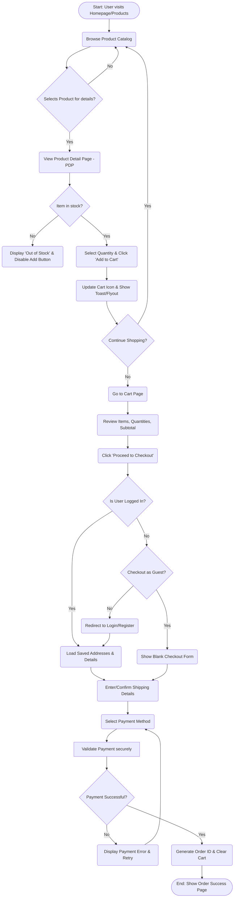
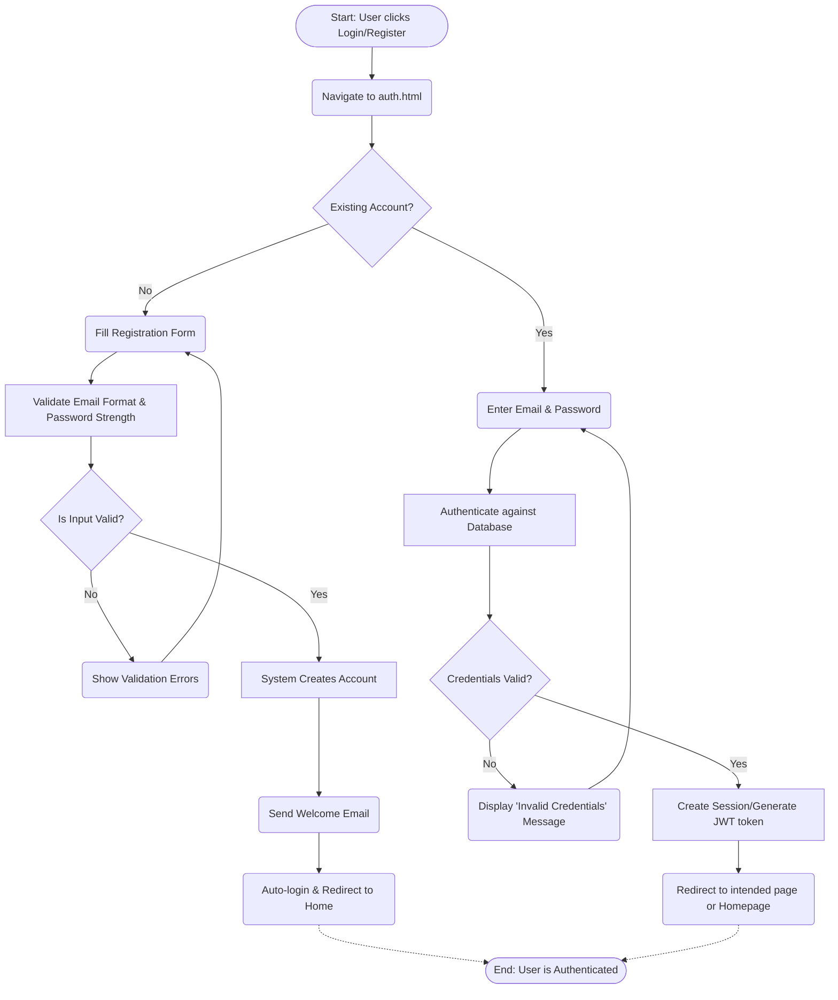

# Business Process Models

**Project:** LuxRoom E-commerce  
**Modeling Standard:** BPMN (represented via Mermaid Flowcharts)

These process models illustrate the core user journeys within the LuxRoom platform.

---

## 1. End-to-End Shopping & Checkout Flow
This represents the primary happy path for a user (either registered or guest) adding items to their cart and completing a purchase, including out-of-stock validation check.

---

## 2. User Authentication Flow
This diagram illustrates how users authenticate into the system out of the standalone `auth.html` page, with robust error handling for invalid credentials.

