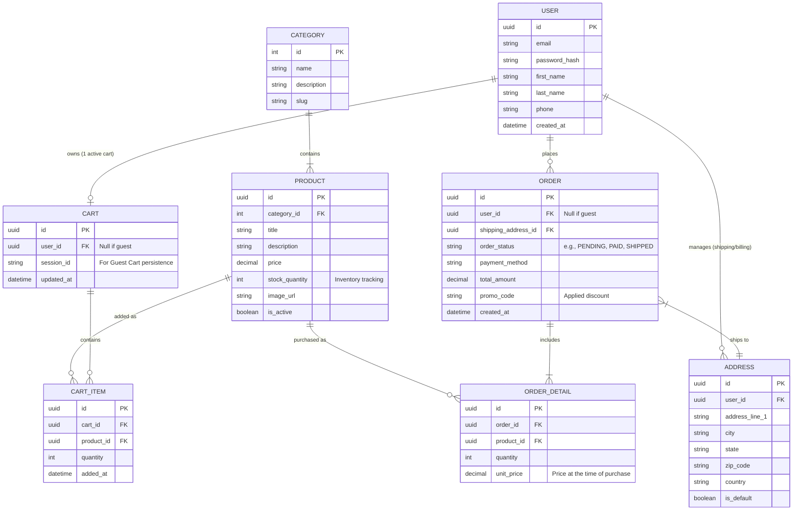

# Conceptual Data Architecture (ERD)

**Project:** LuxRoom E-commerce  
**Modeling Standard:** Entity-Relationship Diagram (ERD) represented via Mermaid.js  

This document outlines the conceptual data model required to support the LuxRoom frontend experience (Users, Products, Cart, Orders, and Addresses).

## Entity-Relationship Diagram

## Data Dictionary Highlights

1.  **Products & Inventory:** The `PRODUCT` table contains `stock_quantity`. This drives the business rule outlined in the PRD where `"Add to Cart"` becomes disabled if `stock_quantity <= 0`.
2.  **Guest Checkout Support:** To support Guest checkouts without forcing registration, the `CART` and `ORDER` tables have a nullable `user_id`. For guests, Carts are tracked via `session_id`, and Orders simply store the `shipping_address_id` (which can be a disconnected record for non-registered users).
3.  **Historical Pricing Stability:** The `ORDER_DETAIL` table deliberately stores `unit_price`. This is a classic E-commerce DB design pattern ensuring that if a Product's price changes in the future, past Orders still reflect the exact price the user paid at the time.
