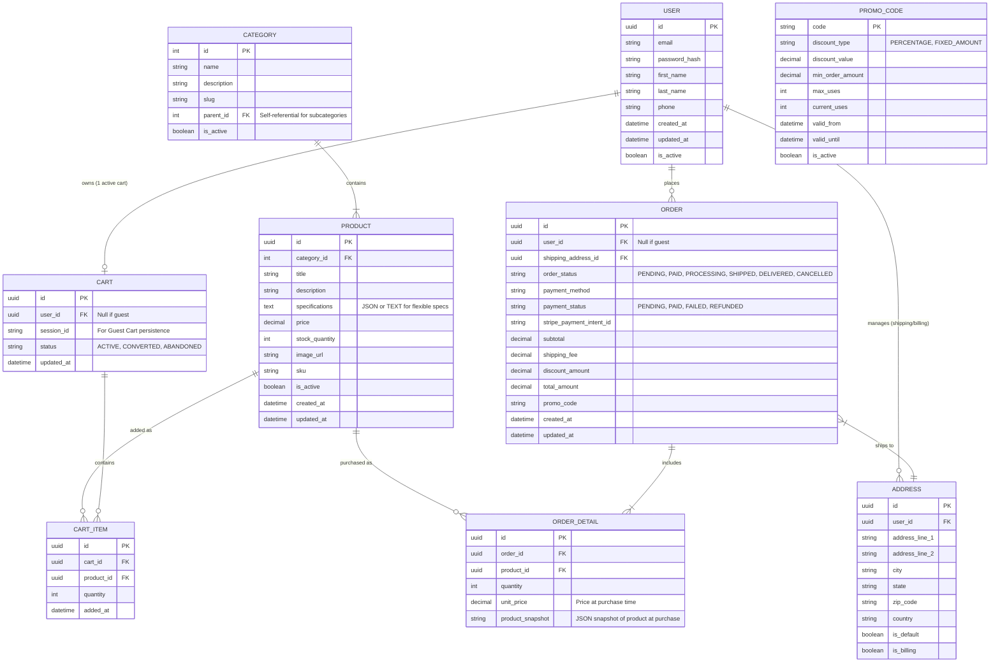

# Conceptual Data Architecture (ERD)

**Project:** LuxRoom E-commerce
**Modeling Standard:** Entity-Relationship Diagram (ERD) via Mermaid.js
**Version:** 1.1

This document outlines the conceptual data model, API specifications, and data management strategies for the LuxRoom platform.

---

## 1. Entity-Relationship Diagram



---

## 2. Data Dictionary

### 2.1 USER

| Field | Type | Constraints | Description |
|:------|:-----|:------------|:------------|
| id | UUID | PK, NOT NULL | Unique user identifier |
| email | VARCHAR(255) | UNIQUE, NOT NULL | User email address |
| password_hash | VARCHAR(255) | NOT NULL | bcrypt hashed password |
| first_name | VARCHAR(100) | NOT NULL | User's first name |
| last_name | VARCHAR(100) | NOT NULL | User's last name |
| phone | VARCHAR(20) | NULL | Phone number |
| created_at | TIMESTAMP | DEFAULT NOW() | Account creation date |
| updated_at | TIMESTAMP | DEFAULT NOW() | Last profile update |
| is_active | BOOLEAN | DEFAULT TRUE | Soft delete flag |

### 2.2 PRODUCT

| Field | Type | Constraints | Description |
|:------|:-----|:------------|:------------|
| id | UUID | PK, NOT NULL | Unique product identifier |
| category_id | INT | FK → CATEGORY | Product category |
| title | VARCHAR(255) | NOT NULL | Product display name |
| description | TEXT | NULL | Full product description |
| specifications | JSON | NULL | Flexible specs (dimensions, materials) |
| price | DECIMAL(10,2) | NOT NULL | Unit price in USD |
| stock_quantity | INT | DEFAULT 0 | Available inventory |
| image_url | VARCHAR(500) | NULL | Primary product image |
| sku | VARCHAR(50) | UNIQUE | Stock keeping unit |
| is_active | BOOLEAN | DEFAULT TRUE | Product visibility |
| created_at | TIMESTAMP | DEFAULT NOW() | Product added date |
| updated_at | TIMESTAMP | DEFAULT NOW() | Last modification |

### 2.3 ORDER

| Field | Type | Constraints | Description |
|:------|:-----|:------------|:------------|
| id | UUID | PK, NOT NULL | Unique order identifier |
| user_id | UUID | FK → USER, NULL | NULL for guest orders |
| shipping_address_id | UUID | FK → ADDRESS | Delivery address |
| order_status | ENUM | NOT NULL | Order lifecycle status |
| payment_method | VARCHAR(50) | NULL | Payment type (card, etc.) |
| payment_status | ENUM | NOT NULL | Payment state |
| stripe_payment_intent_id | VARCHAR(255) | NULL | Stripe reference |
| subtotal | DECIMAL(10,2) | NOT NULL | Items total |
| shipping_fee | DECIMAL(10,2) | DEFAULT 0 | Shipping cost |
| discount_amount | DECIMAL(10,2) | DEFAULT 0 | Promo discount |
| total_amount | DECIMAL(10,2) | NOT NULL | Final charge |
| promo_code | VARCHAR(50) | NULL | Applied promo |
| created_at | TIMESTAMP | DEFAULT NOW() | Order placed |
| updated_at | TIMESTAMP | DEFAULT NOW() | Last status change |

### 2.4 CART

| Field | Type | Constraints | Description |
|:------|:-----|:------------|:------------|
| id | UUID | PK, NOT NULL | Unique cart identifier |
| user_id | UUID | FK → USER, NULL | NULL for guest carts |
| session_id | VARCHAR(255) | NULL | Browser session for guests |
| status | ENUM | DEFAULT 'ACTIVE' | Cart lifecycle |
| updated_at | TIMESTAMP | DEFAULT NOW() | Last modification |

---

## 3. REST API Specifications

### 3.1 Base URL
```
Production: https://api.luxroom.com/v1
Staging: https://api-staging.luxroom.com/v1
```

### 3.2 Authentication
- **Method:** Bearer Token (JWT)
- **Header:** `Authorization: Bearer <token>`
- **Token Expiry:** 24 hours
- **Refresh Token:** 7 days

### 3.3 Endpoints

#### Products

| Method | Endpoint | Description | Auth |
|:-------|:---------|:------------|:-----|
| GET | `/products` | List products (paginated) | No |
| GET | `/products/{id}` | Get product details | No |
| GET | `/products?category={slug}` | Filter by category | No |
| GET | `/products?search={query}` | Search products | No |
| GET | `/categories` | List all categories | No |

**GET /products**
```json
// Request Query Parameters
{
  "page": 1,
  "limit": 20,
  "category": "living-room",
  "sort": "price_asc|price_desc|newest",
  "min_price": 100,
  "max_price": 5000,
  "in_stock": true
}

// Response 200
{
  "data": [
    {
      "id": "uuid",
      "title": "Minimalist Oak Desk",
      "price": 1299.00,
      "image_url": "https://...",
      "stock_quantity": 5,
      "category": "office"
    }
  ],
  "pagination": {
    "page": 1,
    "limit": 20,
    "total": 156,
    "total_pages": 8
  }
}
```

**GET /products/{id}**
```json
// Response 200
{
  "id": "uuid",
  "title": "Minimalist Oak Desk",
  "description": "Handcrafted...",
  "specifications": {
    "dimensions": "160x75x75cm",
    "material": "Solid Oak",
    "weight": "45kg"
  },
  "price": 1299.00,
  "stock_quantity": 5,
  "image_url": "https://...",
  "sku": "LUX-DSK-001",
  "category": {
    "id": 1,
    "name": "Office",
    "slug": "office"
  }
}

// Response 404
{
  "error": "PRODUCT_NOT_FOUND",
  "message": "Product not found"
}
```

#### Cart

| Method | Endpoint | Description | Auth |
|:-------|:---------|:------------|:-----|
| GET | `/cart` | Get current cart | Optional |
| POST | `/cart/items` | Add item to cart | Optional |
| PUT | `/cart/items/{id}` | Update item quantity | Optional |
| DELETE | `/cart/items/{id}` | Remove item from cart | Optional |
| DELETE | `/cart` | Clear entire cart | Optional |
| POST | `/cart/promo` | Apply promo code | Optional |

**POST /cart/items**
```json
// Request
{
  "product_id": "uuid",
  "quantity": 1
}

// Response 201
{
  "data": {
    "id": "uuid",
    "product_id": "uuid",
    "quantity": 1,
    "unit_price": 1299.00,
    "line_total": 1299.00,
    "product": {
      "title": "Minimalist Oak Desk",
      "image_url": "https://..."
    }
  },
  "cart_total": 1299.00
}

// Response 400 (Out of Stock)
{
  "error": "OUT_OF_STOCK",
  "message": "Product is out of stock"
}

// Response 400 (Exceeds Stock)
{
  "error": "INSUFFICIENT_STOCK",
  "message": "Only 5 items available"
}
```

#### Checkout

| Method | Endpoint | Description | Auth |
|:-------|:---------|:------------|:-----|
| POST | `/checkout/shipping` | Submit shipping info | Required |
| POST | `/checkout/payment-intent` | Create Stripe PaymentIntent | Required |
| POST | `/checkout/complete` | Confirm order after payment | Required |

**POST /checkout/payment-intent**
```json
// Request
{
  "shipping_address_id": "uuid",
  "promo_code": "LUX10"
}

// Response 200
{
  "client_secret": "pi_xxx_secret_xxx",
  "order_id": "uuid",
  "amount": 1369.00,
  "breakdown": {
    "subtotal": 1299.00,
    "shipping": 30.00,
    "discount": -129.90,
    "total": 1199.10
  }
}
```

#### Orders

| Method | Endpoint | Description | Auth |
|:-------|:---------|:------------|:-----|
| GET | `/orders` | List user's orders | Required |
| GET | `/orders/{id}` | Get order details | Required |

#### Authentication

| Method | Endpoint | Description | Auth |
|:-------|:---------|:------------|:-----|
| POST | `/auth/register` | Create new account | No |
| POST | `/auth/login` | User login | No |
| POST | `/auth/logout` | User logout | Required |
| POST | `/auth/refresh` | Refresh access token | Required |
| POST | `/auth/forgot-password` | Request password reset | No |
| POST | `/auth/reset-password` | Reset with token | No |

### 3.4 Error Response Format

```json
{
  "error": "ERROR_CODE",
  "message": "Human readable message",
  "details": {
    "field": "specific error info"
  },
  "request_id": "uuid-for-support"
}
```

### 3.5 Rate Limiting

| Endpoint Pattern | Limit |
|:------------------|:------|
| `/auth/*` | 5 requests/minute |
| `/cart/*` | 30 requests/minute |
| `/checkout/*` | 10 requests/minute |
| `/products/*` | 100 requests/minute |

**Rate Limit Headers:**
```
X-RateLimit-Limit: 100
X-RateLimit-Remaining: 95
X-RateLimit-Reset: 1640000000
```

---

## 4. Data Migration Strategy

### 4.1 Migration Principles

1. **Backward Compatibility** - New schema must support old data format
2. **Incremental Migration** - Large tables migrated in batches
3. **Zero Downtime** - Use blue-green deployment for cutover
4. **Rollback Plan** - Each migration has reversible scripts

### 4.2 Migration Phases

#### Phase 1: Schema Migration (v1.0 → v1.1)

| Step | Action | Duration | Risk |
|:-----|:-------|:---------|:-----|
| 1 | Backup current database | 30 min | Low |
| 2 | Create migration scripts | 1 day | Low |
| 3 | Test on staging with production data copy | 2 days | Medium |
| 4 | Schedule maintenance window | - | - |
| 5 | Run migration during low-traffic period | 1-4 hours | High |
| 6 | Verify data integrity | 1 hour | Medium |
| 7 | Monitor for 24 hours | 24 hours | Medium |

#### Phase 2: Data Cleansing

| Entity | Issues | Cleansing Action |
|:-------|:-------|:-----------------|
| USER | Invalid emails | Flag and require re-verification |
| USER | Duplicate accounts | Merge based on email similarity |
| PRODUCT | Missing SKU | Auto-generate SKU from title+id |
| PRODUCT | Zero stock negative | Set to 0 |
| ORDER | Orphaned details | Delete or link to order |
| ADDRESS | Incomplete addresses | Flag for user completion |

### 4.3 Rollback Procedure

```sql
-- Rollback script example
BEGIN TRANSACTION;

-- Restore from backup table
INSERT INTO products_backup
SELECT * FROM products WHERE migration_version = 'v1.0';

-- Drop new columns
ALTER TABLE products DROP COLUMN IF EXISTS specifications;
ALTER TABLE products DROP COLUMN IF EXISTS sku;

-- Mark migration complete
UPDATE migration_log SET status = 'ROLLED_BACK' WHERE version = 'v1.1';

COMMIT;
```

---

## 5. Data Quality Requirements

### 5.1 Quality Dimensions

| Dimension | Target | Measurement |
|:----------|:-------|:------------|
| Completeness | ≥ 99% | NULL checks on required fields |
| Accuracy | ≥ 99.5% | Periodic data audits |
| Consistency | 100% | Cross-field validation rules |
| Timeliness | < 1 min | Real-time stock updates |
| Uniqueness | 100% | No duplicate primary keys |

### 5.2 Validation Rules

#### Product Data
```javascript
{
  title: {
    required: true,
    minLength: 3,
    maxLength: 255,
    pattern: /^[a-zA-Z0-9\s\-]+$/
  },
  price: {
    required: true,
    type: "number",
    min: 0.01,
    max: 999999.99
  },
  stock_quantity: {
    type: "integer",
    min: 0,
    max: 999999
  },
  sku: {
    pattern: /^[A-Z]{3}-[A-Z]{3}-\d{3}$/
  }
}
```

#### User Data
```javascript
{
  email: {
    required: true,
    pattern: /^[^\s@]+@[^\s@]+\.[^\s@]+$/,
    unique: true
  },
  password: {
    required: true,
    minLength: 8,
    pattern: /^(?=.*[A-Z])(?=.*\d).+$/
  },
  first_name: {
    required: true,
    minLength: 1,
    maxLength: 100
  },
  phone: {
    pattern: /^\+?[1-9]\d{1,14}$/
  }
}
```

### 5.3 Data Retention Policy

| Data Type | Retention Period | Disposal Method |
|:----------|:-----------------|:-----------------|
| User accounts | Until deletion requested | Secure delete |
| Order history | 7 years | Anonymize after 3 years |
| Cart data | 30 days inactive | Auto-delete |
| Session tokens | 24 hours | Auto-expire |
| Audit logs | 2 years | Archive then delete |
| Payment records | 7 years (PCI requirement) | Encrypted retention |

### 5.4 Data Quality Checks

```sql
-- Daily DQ Check Queries

-- Completeness: Check for NULLs in required fields
SELECT COUNT(*) as null_emails
FROM users
WHERE email IS NULL;

-- Accuracy: Check for negative prices
SELECT COUNT(*) as negative_prices
FROM products
WHERE price < 0;

-- Consistency: Check for mismatched totals
SELECT COUNT(*) as mismatched_totals
FROM orders
WHERE total_amount != subtotal + shipping_fee - discount_amount;

-- Uniqueness: Check for duplicate SKUs
SELECT sku, COUNT(*) as cnt
FROM products
GROUP BY sku
HAVING COUNT(*) > 1;
```

---

## 6. Security & Data Masking

### 6.1 Sensitive Data Classification

| Data Type | Classification | Storage | Masking |
|:----------|:---------------|:--------|:--------|
| Password | PII - Critical | bcrypt hash only | N/A |
| Email | PII - Standard | Plain text | Partial: j***@gmail.com |
| Phone | PII - Standard | Plain text | Partial: ***-***-1234 |
| Credit Card | PCI - Critical | Stripe only | Never stored |
| Address | PII - Standard | Plain text | None (needed for shipping) |

### 6.2 Data Masking Rules

```javascript
// Email masking
function maskEmail(email) {
  const [local, domain] = email.split('@');
  const maskedLocal = local[0] + '***';
  return maskedLocal + '@' + domain;
}

// Phone masking
function maskPhone(phone) {
  return phone.slice(-4).padStart(phone.length, '*');
}
```

---

## Document History

| Version | Date | Author | Changes |
|:--------|:-----|:-------|:--------|
| 1.0 | April 2026 | BA | Initial data architecture |
| 1.1 | April 2026 | BA | Added: API specs (full endpoints), Data Migration Strategy, Data Quality Requirements, Security/Data Masking |
