# Sơ Đồ Use Case — LuxRoom E-commerce

**Project:** LuxRoom E-commerce
**Loại:** Use Case Diagram (UML)
**Version:** 1.0
**Mục đích:** Xác định các chức năng hệ thống và ai được phép làm gì

---

## 1. Tổng Quan Use Case

Sơ đồ Use Case cho biết:
- **Ai** (Actor) tương tác với hệ thống
- **Làm gì** (Use Case) trên hệ thống
- **Ai làm được việc gì** (quyền hạn)

---

## 2. Danh Sách Actors (Người Dùng/Hệ Thống)

| Actor | Mô tả | Loại |
|:------|:------|:-----|
| **Khách (Guest)** | Người chưa đăng nhập, chỉ duyệt và mua không cần tài khoản | Primary |
| **Khách hàng (Customer)** | Người đã đăng ký, có tài khoản | Primary |
| **Quản trị viên (Admin)** | Người quản lý sản phẩm, đơn hàng, nội dung | Primary |
| **Stripe** | Hệ thống thanh toán bên ngoài | External |
| **Email Service** | Dịch vụ gửi email (SendGrid/SES) | External |
| **Inventory System** | Hệ thống kho hàng (tương lai) | External |

---

## 3. Sơ Đồ Use Case Chính

```mermaid
graph TB
    subgraph System["Ranh giới Hệ thống LuxRoom"]
        subgraph CustomerActions["Chức năng Khách hàng"]
            UC1[("Duyệt sản phẩm")]
            UC2[("Tìm kiếm sản phẩm")]
            UC3[("Xem chi tiết sản phẩm")]
            UC4[("Thêm vào giỏ hàng")]
            UC5[("Xem giỏ hàng")]
            UC6[("Điều chỉnh giỏ hàng")]
            UC7[("Đặt hàng (Checkout)")]
            UC8[("Thanh toán")]
            UC9[("Tạo tài khoản")]
            UC10[("Đăng nhập")]
            UC11[("Xem lịch sử đơn hàng")]
            UC12[("Theo dõi đơn hàng")]
            UC13[("Quản lý tài khoản")]
            UC14[("Đăng xuất")]
        end

        subgraph AdminActions["Chức năng Quản trị"]
            UC15[("Quản lý sản phẩm")]
            UC16[("Quản lý đơn hàng")]
            UC17[("Xem báo cáo")]
            UC18[("Quản lý tồn kho")]
        end

        subgraph SharedActions["Chức năng Chung"]
            UC19[("Đăng nhập")]
            UC20[("Đăng xuất")]
        end
    end

    subgraph External["Hệ thống bên ngoài"]
        STRIPE[("💳 Stripe")]
        EMAIL[("📧 Email Service")]
    end

    subgraph Actors["Actors (Người dùng)"]
        GUEST[/"Khách chưa đăng nhập"\]
        CUSTOMER[/"Khách hàng đã đăng ký"\]
        ADMIN[/"Quản trị viên"\]
    end

    %% Guest Actors
    GUEST --> UC1
    GUEST --> UC2
    GUEST --> UC3
    GUEST --> UC4
    GUEST --> UC5
    GUEST --> UC7
    GUEST --> UC8
    GUEST --> UC9

    %% Customer Actors
    CUSTOMER --> UC1
    CUSTOMER --> UC2
    CUSTOMER --> UC3
    CUSTOMER --> UC4
    CUSTOMER --> UC5
    CUSTOMER --> UC6
    CUSTOMER --> UC7
    CUSTOMER --> UC8
    CUSTOMER --> UC10
    CUSTOMER --> UC11
    CUSTOMER --> UC12
    CUSTOMER --> UC13
    CUSTOMER --> UC14

    %% Admin Actors
    ADMIN --> UC15
    ADMIN --> UC16
    ADMIN --> UC17
    ADMIN --> UC18
    ADMIN --> UC20

    %% External System connections
    UC8 --> STRIPE
    UC9 --> EMAIL
    UC11 --> EMAIL
    UC12 --> EMAIL
    UC17 --> EMAIL

    %% Include relationships
    UC7 --> UC8
    UC7 --> UC4
    UC12 --> UC1
    UC15 --> UC18

    %% Extend relationships
    UC6 -.->|extend| UC5
    UC13 -.->|extend| UC10
```

---

## 4. Mô Tả Chi Tiết Từng Use Case

### 4.1 Chức Năng Duyệt Sản Phẩm

| Use Case | UC-01: Duyệt sản phẩm |
|:---------|:---------------------|
| **Actor** | Khách, Khách hàng |
| **Mô tả** | Người dùng xem danh sách sản phẩm theo danh mục |
| **Điều kiện bắt đầu** | Người dùng vào trang chủ hoặc trang danh mục |
| **Luồng chính** | 1. Hệ thống hiển thị danh sách sản phẩm 2. Người dùng chọn danh mục 3. Hệ thống lọc và hiển thị sản phẩm trong danh mục |
| **Luồng phụ** | - Lọc theo giá - Sắp xếp (mới nhất, giá cao/thấp) - Phân trang |
| **Kết thúc** | Người dùng chọn xem chi tiết sản phẩm hoặc quay lại |

### 4.2 Chức Năng Thêm Vào Giỏ Hàng

| Use Case | UC-04: Thêm vào giỏ hàng |
|:---------|:------------------------|
| **Actor** | Khách, Khách hàng |
| **Mô tả** | Thêm sản phẩm vào giỏ để chuẩn bị mua |
| **Điều kiện bắt đầu** | Người dùng đang xem chi tiết sản phẩm |
| **Luồng chính** | 1. Người dùng chọn số lượng 2. Click "Thêm vào giỏ" 3. Hệ thống kiểm tra tồn kho 4. Hệ thống cập nhật giỏ hàng 5. Hiển thị thông báo thành công |
| **Luồng phụ** | - Hết hàng: Hiện nút "Thông báo khi có hàng" - Vượt số lượng tồn: Cảnh báo số lượng còn lại |
| **Điều kiện kết thúc** | Giỏ hàng được cập nhật, toast notification hiển thị |

### 4.3 Chức Năng Thanh Toán

| Use Case | UC-08: Thanh toán |
|:---------|:------------------|
| **Actor** | Khách, Khách hàng |
| **Mô tảả** | Thực hiện thanh toán đơn hàng qua Stripe |
| **Include** | UC-04 (đã có sản phẩm trong giỏ) |
| **Luồng chính** | 1. Người dùng điền thông tin giao hàng 2. Chọn phương thức thanh toán 3. Hệ thống tạo PaymentIntent với Stripe 4. Người dùng nhập thông tin thẻ 5. Stripe xác nhận thanh toán 6. Hệ thống tạo đơn hàng |
| **Luồng phụ** | - Thanh toán thất bại: Cho phép thử lại - Mã khuyến mãi: Áp dụng giảm giá |
| **Kết thúc** | Hiển thị trang xác nhận đơn hàng |

### 4.4 Chức Năng Quản Lý Sản Phẩm (Admin)

| Use Case | UC-15: Quản lý sản phẩm |
|:---------|:------------------------|
| **Actor** | Quản trị viên |
| **Mô tả** | Thêm, sửa, xóa sản phẩm trong danh mục |
| **Luồng chính** | 1. Admin đăng nhập trang quản trị 2. Chọn "Quản lý sản phẩm" 3. Thêm mới / Chỉnh sửa / Xóa sản phẩm 4. Hệ thống cập nhật database |
| **CRUD Operations** | Create - Thêm sản phẩm mới Read - Xem danh sách, tìm kiếm Update - Sửa thông tin, giá, tồn kho Delete - Ẩn sản phẩm (soft delete) |
| **Kết thúc** | Danh sách sản phẩm được cập nhật |

---

## 5. Ma Trận Actor - Use Case

| Use Case | Guest | Customer | Admin | Stripe | Email |
|:---------|------:|---------:|------:|-------:|------:|
| Duyệt sản phẩm | ✅ | ✅ | ✅ | - | - |
| Tìm kiếm | ✅ | ✅ | ✅ | - | - |
| Xem chi tiết | ✅ | ✅ | ✅ | - | - |
| Thêm giỏ hàng | ✅ | ✅ | ✅ | - | - |
| Xem giỏ hàng | ✅ | ✅ | ✅ | - | - |
| Đặt hàng | ✅ | ✅ | - | - | - |
| Thanh toán | ✅ | ✅ | - | ✅ | - |
| Tạo tài khoản | ✅ | - | - | - | ✅ |
| Đăng nhập | ✅ | ✅ | ✅ | - | - |
| Đăng xuất | - | ✅ | ✅ | - | - |
| Lịch sử đơn | - | ✅ | ✅ | - | ✅ |
| Theo dõi đơn | - | ✅ | ✅ | - | ✅ |
| Quản lý sản phẩm | - | - | ✅ | - | - |
| Quản lý đơn hàng | - | - | ✅ | - | - |
| Xem báo cáo | - | - | ✅ | - | - |

---

## 6. Include vs Extend

### Include (Bắt buộc phải có)

| Use Case chính | Include | Giải thích |
|:---------------|:--------|:-----------|
| Đặt hàng (UC-07) | Thêm giỏ hàng (UC-04) | Phải có sản phẩm trong giỏ mới đặt được |
| Đặt hàng (UC-07) | Thanh toán (UC-08) | Thanh toán là bước bắt buộc của đặt hàng |

### Extend (Mở rộng tùy chọn)

| Use Case chính | Extend | Giải thích |
|:---------------|:-------|:-----------|
| Xem giỏ hàng (UC-05) | Điều chỉnh giỏ hàng (UC-06) | Chỉ hiện khi người dùng muốn sửa |
| Quản lý tài khoản (UC-13) | Đăng nhập (UC-10) | Chỉ cần đăng nhập khi chưa đăng nhập |

---

## 7. Quy Tắc Nghiệp Vụ Liên Quan

| ID | Quy tắc | Use Case liên quan |
|:---|:--------|:-------------------|
| BR-02 | Không cho thêm vào giỏ khi hết hàng | UC-04 |
| BR-07 | Khách vẫn mua được mà không cần đăng ký | UC-07, UC-08 |
| BR-08 | Miễn phí vận chuyển cho đơn trên $500 | UC-08 |

---

## Document History

| Version | Date | Author | Changes |
|:--------|:-----|:-------|:---------|
| 1.0 | May 2026 | BA | Initial Use Case diagram |
