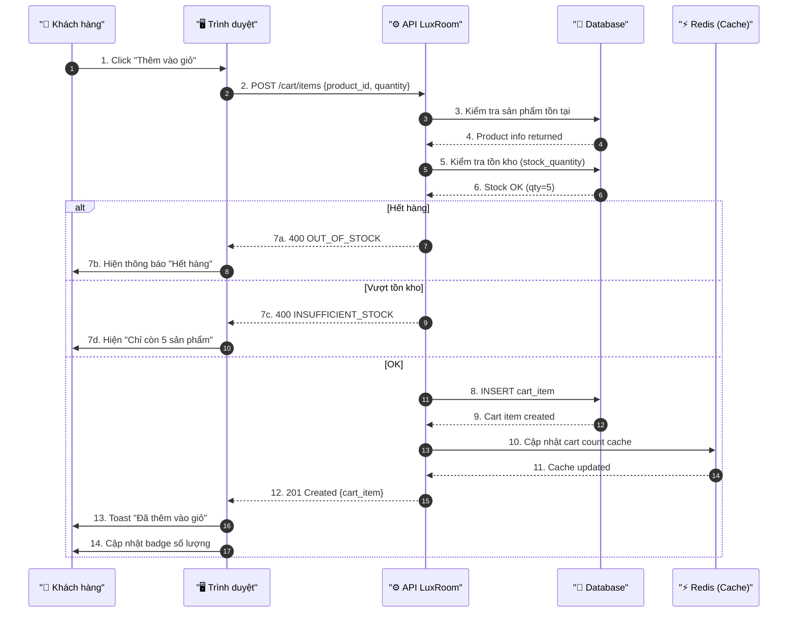
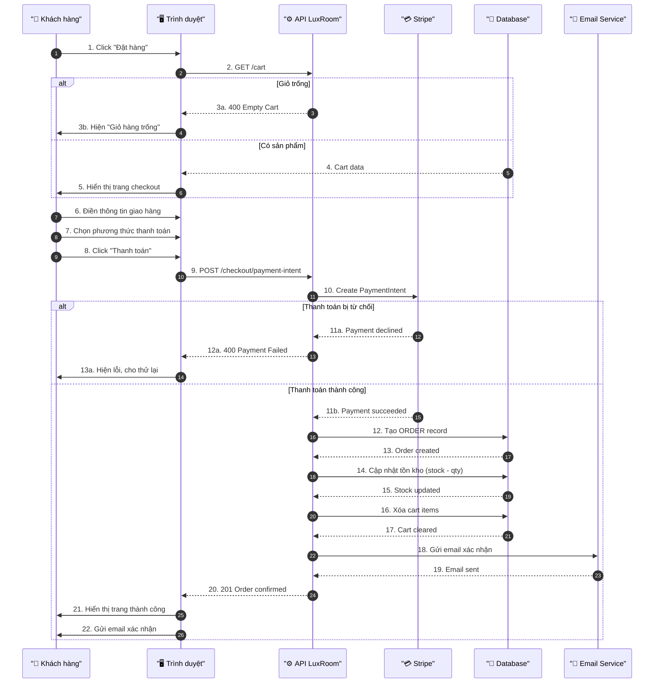
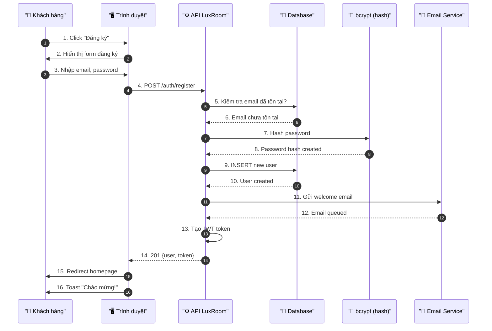
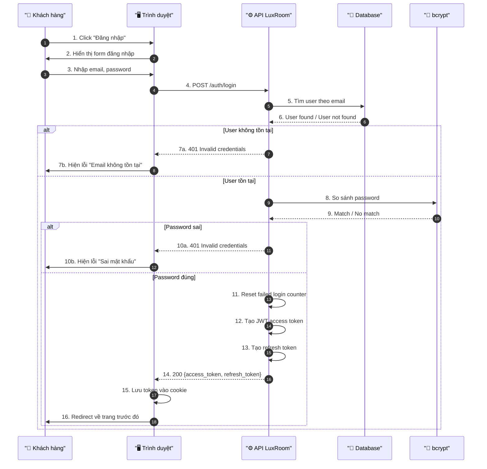
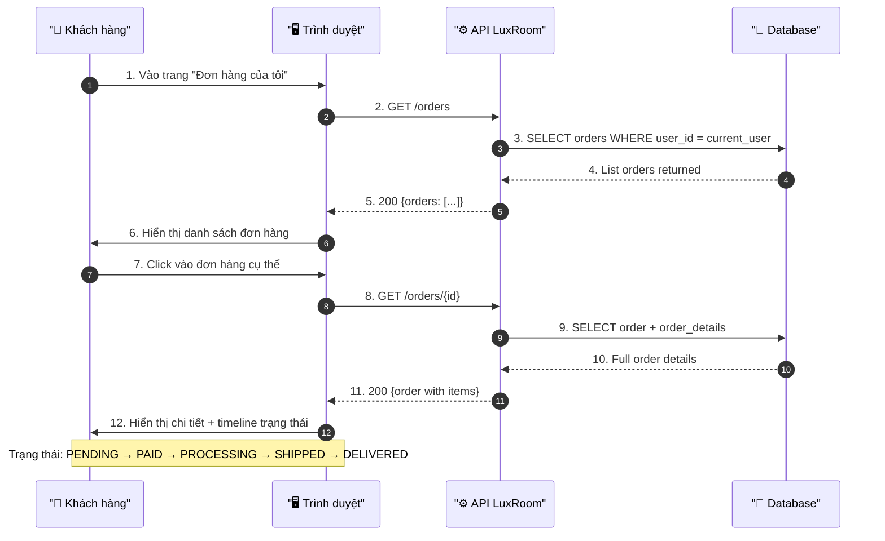
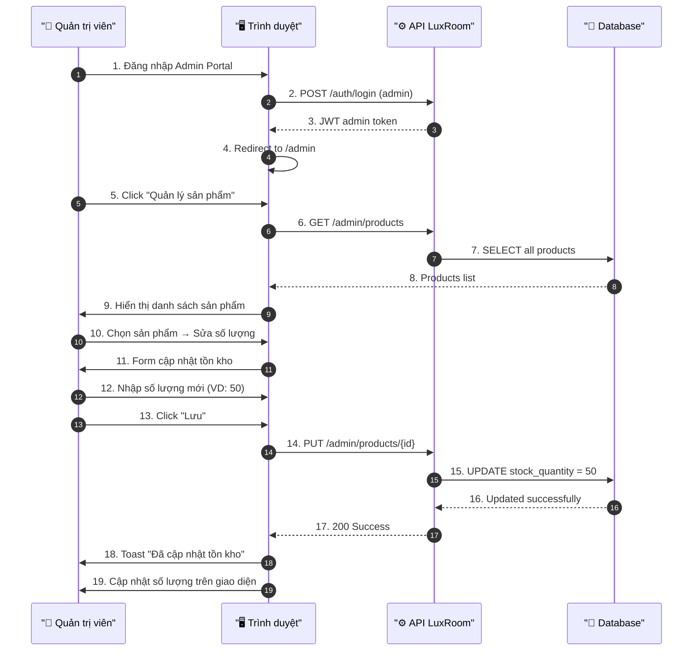

# Sơ Đồ Sequence — LuxRoom E-commerce

**Project:** LuxRoom E-commerce
**Loại:** Sequence Diagram (UML)
**Version:** 1.0
**Mục đích:** Mô tả tương tác chi tiết theo thời gian giữa các thành phần

---

## 1. Tổng Quan Sequence Diagram

Sequence Diagram cho biết:
- **Thứ tự thời gian** các bước xảy ra
- **Ai** (Actor, System, Database) tham gia vào từng bước
- **Tin nhắn** (message) được gửi qua lại như thế nào
- **Thời gian chờ** và xử lý ở mỗi bước

---

## 2. Sequence: Thêm Vào Giỏ Hàng

**Mục đích:** Khi khách hàng thêm sản phẩm vào giỏ

**Các bước chính:**
1. Khách click nút "Thêm vào giỏ"
2. Trình duyệt gửi yêu cầu đến API
3. API kiểm tra sản phẩm và tồn kho
4. Nếu OK → lưu vào database
5. Trả kết quả về trình duyệt và cập nhật UI

---

## 3. Sequence: Quy Trình Checkout (Thanh Toán)

**Mục đích:** Từ lúc bắt đầu thanh toán đến hoàn tất đơn hàng

**Các bước chính:**
1. Khách xem giỏ hàng và chuyển sang checkout
2. Điền thông tin giao hàng
3. Tạo PaymentIntent với Stripe
4. Stripe xử lý thanh toán
5. Nếu thành công → tạo đơn hàng, cập nhật kho
6. Gửi email xác nhận cho khách

---

## 4. Sequence: Đăng Ký Tài Khoản

**Mục đích:** Khi khách hàng mới tạo tài khoản

**Các bước chính:**
1. Khách điền form đăng ký
2. API kiểm tra email chưa tồn tại
3. Mã hóa password bằng bcrypt
4. Lưu user vào database
5. Gửi email chào mừng
6. Tạo token và đăng nhập tự động

---

## 5. Sequence: Đăng Nhập

**Mục đích:** Khi khách hàng đăng nhập vào tài khoản

---

## 6. Sequence: Theo Dõi Trạng Thái Đơn Hàng

**Mục đích:** Khi khách xem tình trạng đơn hàng

---

## 7. Sequence: Quản Lý Tồn Kho (Admin)

**Mục đích:** Khi admin cập nhật số lượng tồn kho

---

## 8. Bảng Tổng Hợp Sequence

| Sequence | Mục đích | Actors | Số bước |
|:---------|:---------|:-------|:--------|
| Thêm vào giỏ | Thêm sản phẩm vào cart | Customer → API → DB | 14 |
| Checkout | Thanh toán đơn hàng | Customer → Browser → API → Stripe → DB → Email | 22 |
| Đăng ký | Tạo tài khoản mới | Customer → API → DB → bcrypt → Email | 16 |
| Đăng nhập | Đăng nhập hệ thống | Customer → API → DB → bcrypt | 16 |
| Theo dõi đơn | Xem trạng thái đơn hàng | Customer → API → DB | 12 |
| Quản lý kho | Admin cập nhật tồn kho | Admin → API → DB | 19 |

---

## Document History

| Version | Date | Author | Changes |
|:--------|:-----|:-------|:---------|
| 1.0 | May 2026 | BA | Initial sequence diagrams |
