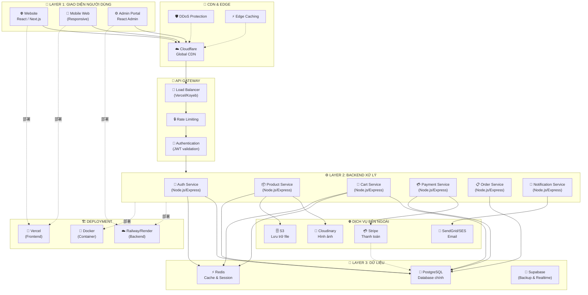
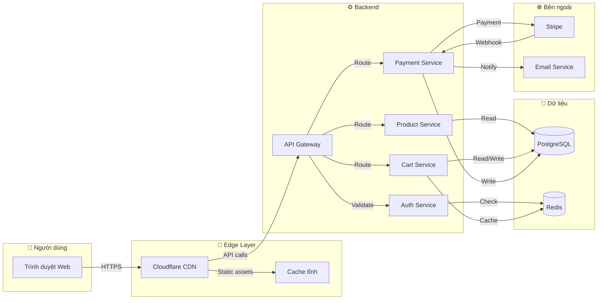
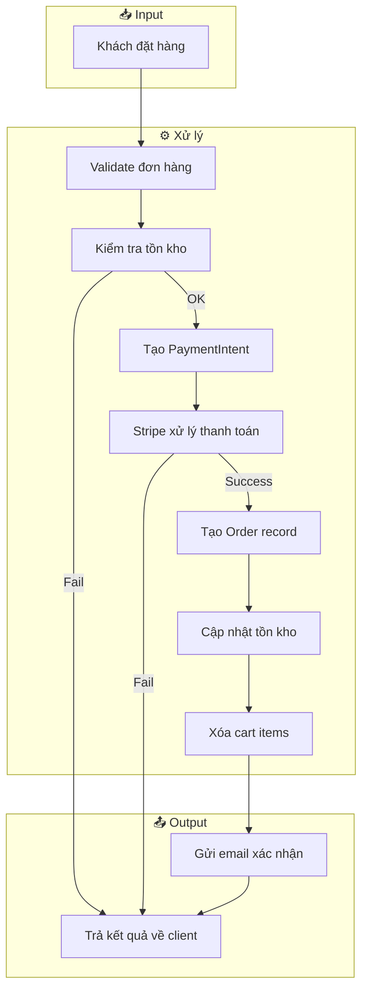
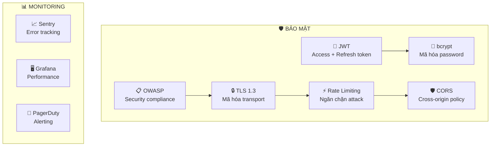
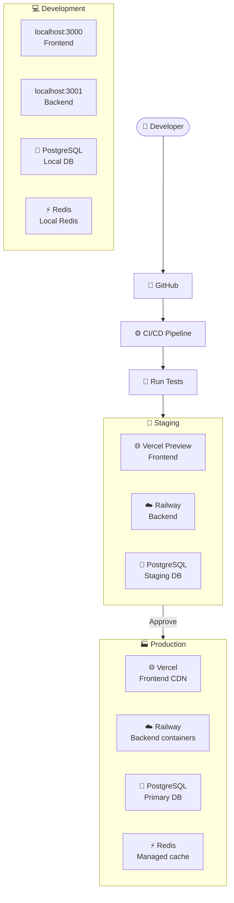

# Sơ Đồ Kiến Trúc Hệ Thống — LuxRoom E-commerce

**Project:** LuxRoom E-commerce
**Loại:** Architecture Diagram
**Version:** 1.0
**Mục đích:** Mô tả tổng quan hệ thống được xây dựng trên nền tảng nào, các thành phần tương tác ra sao

---

## 1. Tổng Quan Kiến Trúc

Sơ đồ này cho biết:
- **Hệ thống gồm những phần nào** (layers/components)
- **Luồng dữ liệu** đi từ đâu đến đâu
- **Công nghệ** sử dụng cho mỗi phần
- **Hệ thống bên ngoài** nào được tích hợp

---

## 2. Sơ Đồ Kiến Trúc Tổng Quan



---

## 3. Sơ Đồ Luồng Dữ Liệu (Data Flow)

### 3.1 Luồng Người Dùng Mua Hàng



### 3.2 Luồng Xử Lý Đơn Hàng



---

## 4. Kiến Trúc Chi Tiết Theo Layer

### 4.1 Layer 1: Giao Diện Người Dùng

| Component | Công nghệ | Mô tả |
|:----------|:---------|:-------|
| Website | Next.js / React | Giao diện chính cho khách hàng |
| Admin Portal | React Admin | Trang quản trị cho admin |
| Mobile Web | Responsive CSS | Giao diện tương thích điện thoại |

**Luồng hoạt động:**
```
User → Browser → Cloudflare CDN → Static assets (cached)
                         ↓
                   API Gateway → Backend Services
```

### 4.2 Layer 2: Backend Services

| Service | Port | Chức năng | Database |
|:--------|:-----|:---------|:---------|
| Auth Service | 3001 | Đăng nhập, đăng ký, JWT | PostgreSQL + Redis |
| Product Service | 3002 | Quản lý sản phẩm, danh mục | PostgreSQL |
| Cart Service | 3003 | Quản lý giỏ hàng | PostgreSQL + Redis |
| Payment Service | 3004 | Xử lý thanh toán Stripe | PostgreSQL |
| Order Service | 3005 | Quản lý đơn hàng | PostgreSQL |
| Notification Service | 3006 | Gửi email, notification | SendGrid |

### 4.3 Layer 3: Dữ Liệu

| Database | Mục đích | Dữ liệu |
|:---------|:---------|:---------|
| PostgreSQL | Database chính | Users, Products, Orders, Cart |
| Redis | Cache & Session | Session token, Cart cache, Rate limit |
| Cloudinary/S3 | Lưu trữ hình ảnh | Product images, Assets |

---

## 5. Bảng Tích Hợp Hệ Thống Bên Ngoài

| External Service | Mục đích | Data Exchange |
|:----------------|:---------|:-------------|
| Stripe | Thanh toán online | PaymentIntent, Webhooks |
| SendGrid/SES | Gửi email | Transactional emails |
| Cloudinary | CDN cho hình ảnh | Product image URLs |
| Vercel | Hosting frontend | Deploy trigger |
| Railway | Hosting backend | Container deployment |

---

## 6. Security Architecture



---

## 7. Deployment Architecture



---

## 8. Network Ports & Endpoints

| Service | Internal Port | Public Endpoint |
|:--------|:-------------|:----------------|
| Frontend | 3000 | luxroom.com |
| API Gateway | 8080 | api.luxroom.com |
| Auth Service | 3001 | api.luxroom.com/auth |
| Product Service | 3002 | api.luxroom.com/products |
| Cart Service | 3003 | api.luxroom.com/cart |
| Payment Service | 3004 | api.luxroom.com/checkout |
| Order Service | 3005 | api.luxroom.com/orders |
| Admin API | 3006 | admin.luxroom.com/api |

---

## Document History

| Version | Date | Author | Changes |
|:--------|:-----|:-------|:---------|
| 1.0 | May 2026 | BA | Initial architecture diagram |
