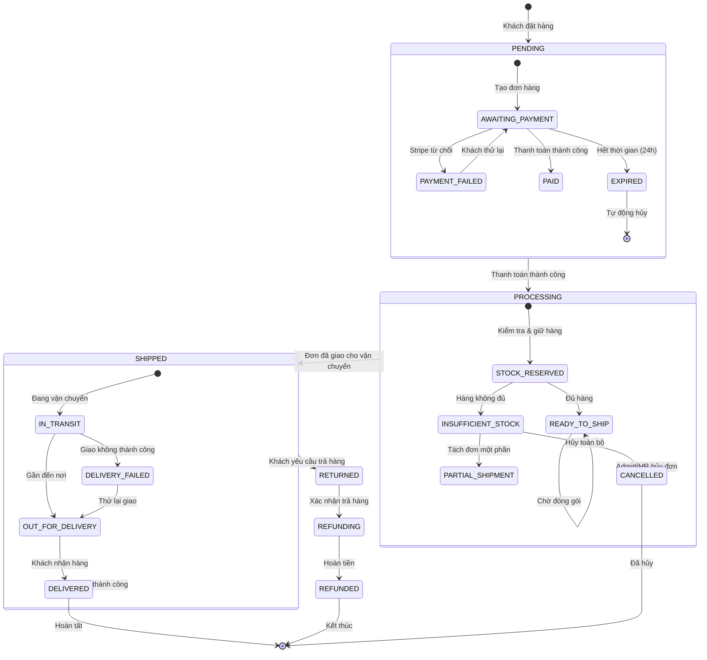
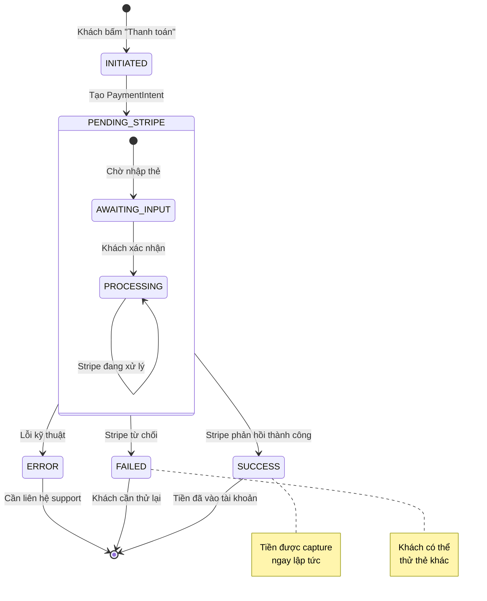

# Sơ Đồ Trạng Thái — LuxRoom E-commerce

**Project:** LuxRoom E-commerce
**Loại:** State Diagram (UML State Machine)
**Version:** 1.0
**Mục đích:** Theo dõi vòng đời của các đối tượng chính (Order, Cart, User)

---

## 1. Tổng Quan State Diagram

State Diagram cho biết:
- **Một đối tượng** (Order, Cart, User) có những **trạng thái** nào
- **Chuyển đổi** từ trạng thái này sang trạng thái khác như thế nào
- **Điều kiện gì** khiến trạng thái thay đổi
- **Sự kiện/Action** nào xảy ra khi chuyển đổi

---

## 2. Sơ Đồ Trạng Thái Đơn Hàng (Order Lifecycle)

Đây là vòng đời quan trọng nhất — theo dõi đơn hàng từ lúc khách đặt đến khi nhận được hàng



---

## 3. Giải Thích Chi Tiết Từng Trạng Thái

### 3.1 Trạng Thái PENDING (Chờ Thanh Toán)

| Trạng thái con | Mô tả | Thời gian tối đa |
|:--------------|:------|:-----------------|
| AWAITING_PAYMENT | Chờ khách thanh toán | 24 giờ |
| PAYMENT_FAILED | Thanh toán bị Stripe từ chối | - |
| EXPIRED | Hết thời gian chờ, tự động hủy | 24 giờ |

**Quy tắc chuyển đổi:**
```
AWAITING_PAYMENT -- Stripe success --> PAID
AWAITING_PAYMENT -- Stripe decline --> PAYMENT_FAILED
AWAITING_PAYMENT -- 24h timeout --> EXPIRED
PAYMENT_FAILED -- Customer retries --> AWAITING_PAYMENT
EXPIRED -- Auto cancel --> [*]
```

### 3.2 Trạng Thái PROCESSING (Đang Xử Lý)

| Trạng thái con | Mô tả | Thời gian tối đa |
|:--------------|:------|:-----------------|
| STOCK_RESERVED | Đã kiểm tra và giữ hàng trong kho | - |
| INSUFFICIENT_STOCK | Hàng không đủ để fulfill đủ | - |
| READY_TO_SHIP | Đã đóng gói, sẵn sàng giao | - |

**Quy tắc chuyển đổi:**
```
STOCK_RESERVED -- Stock OK --> READY_TO_SHIP
STOCK_RESERVED -- Stock < Order qty --> INSUFFICIENT_STOCK
INSUFFICIENT_STOCK -- Admin approves partial --> PARTIAL_SHIPMENT
INSUFFICIENT_STOCK -- Full cancel --> CANCELLED
READY_TO_SHIP -- Warehouse picks --> SHIPPED
```

### 3.3 Trạng Thái SHIPPED (Đã Giao)

| Trạng thái con | Mô tả | Thời gian tối đa |
|:--------------|:------|:-----------------|
| IN_TRANSIT | Đang trên đường giao | 5-7 ngày |
| OUT_FOR_DELIVERY | Đang trong chuyến giao cuối | 1 ngày |
| DELIVERY_FAILED | Giao không thành công (khách không nhận) | 3 ngày |

**Quy tắc chuyển đổi:**
```
IN_TRANSIT -- Carrier scans --> OUT_FOR_DELIVERY
IN_TRANSIT -- Delivery attempt fail --> DELIVERY_FAILED
OUT_FOR_DELIVERY -- Customer receives --> DELIVERED
DELIVERY_FAILED -- Retry delivery --> OUT_FOR_DELIVERY
DELIVERY_FAILED -- After 3 retries --> RETURNED
```

### 3.4 Trạng Thái Trả Hàng (RETURN/REFUND)

| Trạng thái | Mô tả | Thời gian tối đa |
|:----------|:------|:-----------------|
| RETURNED | Khách yêu cầu trả hàng | 30 ngày sau delivery |
| REFUNDING | Đang xử lý hoàn tiền | 5 ngày làm việc |
| REFUNDED | Đã hoàn tiền vào thẻ | - |

---

## 4. Sơ Đồ Trạng Thái Giỏ Hàng (Cart Lifecycle)

```mermaid
stateDiagram-v2
    [*] --> EMPTY: Tạo giỏ hàng mới

    state EMPTY {
        [*] --> NEW_CART: Bắt đầu mua sắm
        NEW_CART --> ACTIVE: Thêm sản phẩm đầu tiên
    }

    EMPTY --> ACTIVE: Thêm sản phẩm

    state ACTIVE {
        [*] --> ACTIVE: Giỏ đang có sản phẩm
        ACTIVE --> UPDATED: Thêm/sửa/xóa sản phẩm
        ACTIVE --> EXPIRED: Không hoạt động 30 ngày
    }

    UPDATED --> ACTIVE
    ACTIVE --> ABANDONED: Khách rời site không mua

    ACTIVE --> CONVERTED: Khách thanh toán thành công
    ABANDONED --> [*]: Tự động xóa sau 30 ngày
    CONVERTED --> [*]: Đơn hàng đã tạo

    note right of ABANDONED
        Hệ thống có thể gửi
        email nhắc khách
        quay lại (Phase 2)
    end note
```

---

## 5. Sơ Đồ Trạng Thái Người Dùng (User Account)

```mermaid
stateDiagram-v2
    [*] --> GUEST: Truy cập lần đầu

    GUEST --> REGISTERING: Đăng ký tài khoản
    REGISTERING --> ACTIVE: Xác nhận email

    state ACTIVE {
        [*] --> ACTIVE: Tài khoản đang hoạt động
        ACTIVE --> SUSPENDED: Vi phạm quy định
        ACTIVE --> DORMANT: Không đăng nhập 6 tháng
    }

    SUSPENDED --> ACTIVE: Admin mở khóa
    SUSPENDED --> DEACTIVATED: Admin khóa vĩnh viễn

    DORMANT --> ACTIVE: Đăng nhập lại
    DORMANT --> DEACTIVATED: 12 tháng không hoạt động

    DEACTIVATED --> [*]: Xóa account (GDPR request)

    note right of SUSPENDED
        Account bị khóa tạm thời
        do: spam, fraud, abuse
    end note

    note right of DORMANT
        Account không hoạt động
        có thể xóa theo GDPR
    end note
```

---

## 6. Sơ Đồ Trạng Thái Thanh Toán (Payment)



---

## 7. Bảng Tổng Hợp Trạng Thái

| Entity | Trạng thái | Số lượng | Ghi chú |
|:-------|:---------|:--------:|:--------|
| **Order** | PENDING → PROCESSING → SHIPPED → DELIVERED | 4 trạng thái chính | + RETURN/REFUND |
| **Cart** | EMPTY → ACTIVE → CONVERTED/ABANDONED | 3 trạng thái | Guest carts expire 30 days |
| **User** | GUEST → ACTIVE → DORMANT/DEACTIVATED | 4 trạng thái | |
| **Payment** | INITIATED → SUCCESS/FAILED | 3 trạng thái | |

---

## 8. Quy Tắc Nghiệp Vụ Liên Quan

| Rule ID | Quy tắc | Trạng thái liên quan |
|:--------|:--------|:-------------------|
| BR-04 | Lỗi nếu item hết hàng trước thanh toán | PENDING → PROCESSING |
| Order Timeout | Đơn chưa thanh toán sau 24h tự hủy | PENDING.EXPIRED |
| Return Window | Trả hàng trong 30 ngày sau delivery | DELIVERED → RETURNED |
| Refund Timeline | Hoàn tiền trong 5 ngày làm việc | REFUNDING → REFUNDED |

---

## Document History

| Version | Date | Author | Changes |
|:--------|:-----|:-------|:---------|
| 1.0 | May 2026 | BA | Initial state diagrams |
