# SỔ TAY VẼ SƠ ĐỒ NGHIỆP VỤ — DÀNH CHO IT BA CHUYÊN NGHIỆP

**Tác giả:** IT Business Analyst  
**Phiên bản:** 1.0  
**Mục đích:** Bộ công thức tổng quát — áp dụng được cho MỌI dự án, MỌI bài toán  

---

> **Cách dùng tài liệu này:**  
> Đây là **bộ công thức chuẩn**. Mỗi loại sơ đồ có: Định nghĩa → Khi nào vẽ → Công thức bước → Ví dụ thực tế → Lỗi thường gặp.  
> Bạn chỉ cần đọc phần tương ứng, làm theo từng bước là vẽ được.

---

# MỤC LỤC

| # | Loại Sơ Đồ | Câu hỏi trả lời | Trang |
|:--|:-----------|:----------------|:------|
| 1 | **Use Case Diagram** | Hệ thống làm được gì? Ai dùng? | Phần 1 |
| 2 | **Activity / Flowchart** | Quy trình diễn ra như thế nào? | Phần 2 |
| 3 | **Swimlane Diagram** | Ai chịu trách nhiệm từng bước? | Phần 3 |
| 4 | **Sequence Diagram** | Các thành phần giao tiếp thế nào? | Phần 4 |
| 5 | **ERD** | Dữ liệu được lưu như thế nào? | Phần 5 |
| 6 | **State Machine Diagram** | Trạng thái thay đổi ra sao? | Phần 6 |
| 7 | **Architecture Diagram** | Hệ thống gồm những tầng nào? | Phần 7 |
| 8 | **DFD** | Dữ liệu chạy qua đâu? | Phần 8 |
| 9 | **Sitemap & User Flow** | Cấu trúc trang & hành trình người dùng? | Phần 9 |
| 10 | **Wireframe** | Giao diện trông như thế nào? | Phần 10 |
| 11 | **Checklist & Anti-patterns** | Kiểm tra trước khi nộp | Phần 11 |

---

# PHẦN 1: USE CASE DIAGRAM — "HỆ THỐNG LÀM ĐƯỢC GÌ?"

## 1.1. Định Nghĩa & Mục Đích

Use Case Diagram trả lời **3 câu hỏi cốt lõi**:
- **AI** tương tác với hệ thống? (Actors)
- Họ có thể làm **NHỮNG GÌ**? (Use Cases)
- Hệ thống có **PHẠM VI** đến đâu? (System Boundary)

**Khi nào vẽ:** Giai đoạn đầu dự án — khi cần xác định scope với stakeholder.

---

## 1.2. Các Thành Phần Cần Biết

| Ký hiệu | Tên | Ý nghĩa |
|:--------|:----|:--------|
| `(oval)` | Use Case | Một chức năng hệ thống |
| `[hình người]` | Actor | Người dùng hoặc hệ thống bên ngoài |
| `[hình chữ nhật lớn]` | System Boundary | Ranh giới hệ thống |
| `───────>` | Association | Actor kết nối với Use Case |
| `- - -><<include>>` | Include | UC này LUÔN gọi UC kia |
| `- - -><<extend>>` | Extend | UC này CÓ THỂ gọi UC kia (điều kiện) |
| `──────>` | Generalization | Kế thừa (Actor/UC cha → con) |

### Phân Biệt Include vs Extend

```
<<include>>: BẮT BUỘC — luôn xảy ra
  Ví dụ: "Đặt hàng" LUÔN include "Xác thực người dùng"
  
<<extend>>: TÙY CHỌN — chỉ xảy ra khi có điều kiện
  Ví dụ: "Xem sản phẩm" CÓ THỂ extend "Áp dụng bộ lọc"
```

---

## 1.3. Công Thức Vẽ Use Case (7 Bước)

```
BƯỚC 1: XÁC ĐỊNH ACTORS
─────────────────────────
Hỏi: "Ai tương tác với hệ thống?"
- Người dùng trực tiếp (Primary): Khách hàng, Admin, Nhân viên...
- Hệ thống ngoài (Secondary): API thanh toán, Email service, SMS...
- Hệ thống quản lý (Offstage): Báo cáo, Monitoring...

Tip: Mỗi loại vai trò khác nhau = 1 Actor riêng
     (Khách chưa đăng nhập ≠ Khách đã đăng nhập)

BƯỚC 2: LIỆT KÊ USE CASES
──────────────────────────
Hỏi: "Actor X có thể làm gì với hệ thống?"
- Bắt đầu bằng động từ: Đăng nhập, Xem, Tạo, Cập nhật, Xóa...
- Mỗi UC = 1 mục tiêu hoàn chỉnh của người dùng
- Không quá chi tiết (tránh nhầm với workflow bên trong)

BƯỚC 3: VẼ SYSTEM BOUNDARY
────────────────────────────
- Vẽ hình chữ nhật lớn = ranh giới hệ thống bạn đang làm
- UC nào trong hộp = hệ thống xử lý
- Actor nào ngoài hộp = người/hệ thống bên ngoài

BƯỚC 4: KẾT NỐI ACTOR — USE CASE
──────────────────────────────────
- Kéo đường thẳng từ Actor đến UC họ thực hiện
- Không thêm mũi tên chiều (chỉ đường thẳng)

BƯỚC 5: THÊM QUAN HỆ INCLUDE/EXTEND (nếu cần)
────────────────────────────────────────────────
- Tìm UC nào LUÔN dùng chung 1 bước → dùng <<include>>
- Tìm UC nào CHỈ đôi khi mở rộng → dùng <<extend>>

BƯỚC 6: KIỂM TRA GENERALIZATION
─────────────────────────────────
- Actor cha/con? (Admin kế thừa từ User?)
- UC cha/con? (Thanh toán thẻ / Thanh toán ví ← Thanh toán)

BƯỚC 7: REVIEW VỚI STAKEHOLDER
─────────────────────────────────
- Hỏi: "Đây có phải tất cả những gì hệ thống cần làm không?"
- Hỏi: "Có actor nào bị thiếu không?"
```

---

## 1.4. Template Use Case (Copy & Chỉnh Sửa)

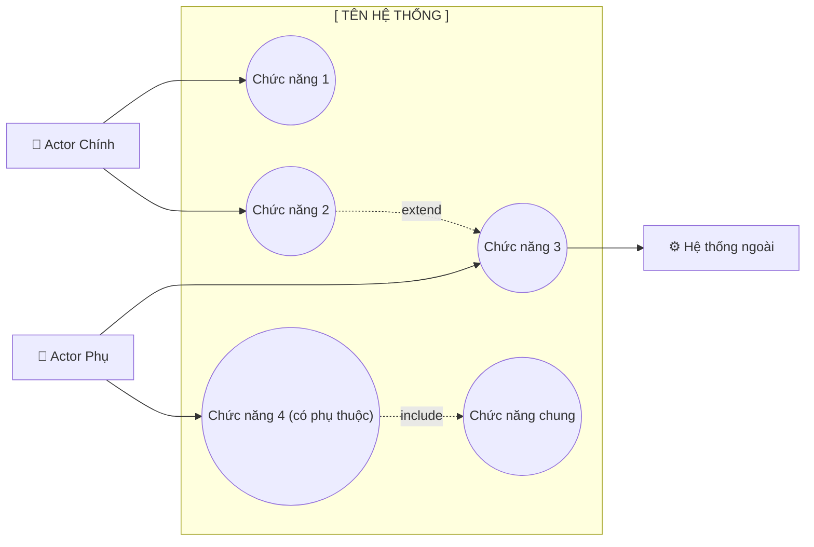

### Ví Dụ Thực Tế — Hệ Thống Quản Lý Thư Viện

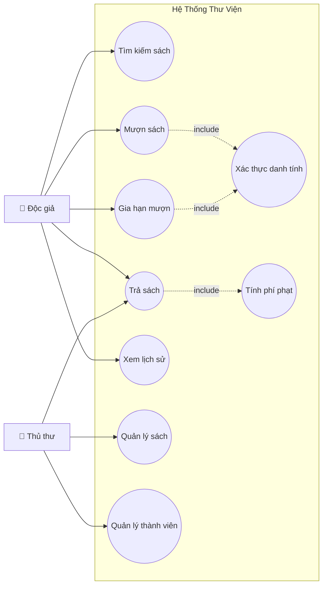

---

## 1.5. Lỗi Thường Gặp & Cách Tránh

| Lỗi | Ví dụ sai | Cách sửa |
|:----|:----------|:---------|
| UC quá chi tiết | "Nhấn nút Submit" | Phải là: "Gửi đơn đăng ký" |
| UC là bước kỹ thuật | "Hash password" | Không vẽ — đây là logic nội bộ |
| Quên Actor ngoài | Không vẽ Email Service | Thêm Actor phụ cho hệ thống bên ngoài |
| Include/Extend nhầm | Dùng Include khi là Extend | Include = BẮT BUỘC, Extend = TÙY CHỌN |
| Quá nhiều UC | 40+ use cases trong 1 diagram | Nhóm theo Epic, vẽ nhiều diagram |

---

# PHẦN 2: ACTIVITY DIAGRAM / FLOWCHART — "QUY TRÌNH DIỄN RA THẾ NÀO?"

## 2.1. Định Nghĩa & Mục Đích

Activity Diagram / Flowchart mô tả **luồng hoạt động** từ đầu đến cuối của một quy trình. Trả lời: **"Bước nào xảy ra trước, bước nào xảy ra sau, điều kiện nào dẫn đến đâu?"**

**Khi nào vẽ:**
- Mô tả quy trình nghiệp vụ (business process)
- Mô tả logic xử lý của một tính năng
- Làm rõ các trường hợp ngoại lệ (exception flow)

---

## 2.2. Các Ký Hiệu Chuẩn

| Ký hiệu | Tên | Dùng khi |
|:--------|:----|:---------|
| `●` (tròn đặc) | Start Node | Điểm bắt đầu — mỗi flow CHỈ có 1 |
| `◎` (tròn viền đôi) | End Node | Điểm kết thúc — có thể có nhiều |
| `[ ]` (hình chữ nhật) | Action / Activity | Một hành động xảy ra |
| `< >` (hình thoi) | Decision | Điểm rẽ nhánh — có điều kiện |
| `═══` (thanh ngang) | Fork / Join | Tách nhánh song song / Gộp lại |
| `───>` | Flow | Hướng đi của luồng |

---

## 2.3. Công Thức Vẽ Activity Diagram (6 Bước)

```
BƯỚC 1: XÁC ĐỊNH PHẠM VI
──────────────────────────
Hỏi: "Quy trình này bắt đầu từ đâu và kết thúc ở đâu?"
- Điểm bắt đầu: Sự kiện kích hoạt (Trigger)
- Điểm kết thúc: Kết quả cuối cùng (có thể nhiều kết thúc)

BƯỚC 2: LIỆT KÊ CÁC BƯỚC CHÍNH (Happy Path)
─────────────────────────────────────────────
- Viết ra các bước khi mọi thứ diễn ra BÌNH THƯỜNG
- Dùng câu ngắn, bắt đầu bằng ĐỘNG TỪ
- Ví dụ: "Nhập thông tin" → "Kiểm tra hợp lệ" → "Lưu vào DB"

BƯỚC 3: TÌM CÁC ĐIỂM QUYẾT ĐỊNH
──────────────────────────────────
- Bước nào có câu hỏi "Có/Không", "Thành công/Thất bại"?
- Mỗi điểm đó = 1 hình thoi (Decision)
- Gắn nhãn rõ cho từng nhánh: [Có] [Không] [Thành công] [Thất bại]

BƯỚC 4: XỬ LÝ CÁC TRƯỜNG HỢP NGOẠI LỆ
──────────────────────────────────────────
- Khi điều kiện KHÔNG thỏa mãn → dẫn đến đâu?
- Có vòng lặp (retry) không?
- Có điểm kết thúc sớm (early exit) không?

BƯỚC 5: KIỂM TRA HOẠT ĐỘNG SONG SONG
────────────────────────────────────────
- Có bước nào xảy ra ĐỒNG THỜI không?
  Ví dụ: "Gửi email" và "Cập nhật DB" chạy song song
- Dùng Fork (═══) để tách và Join (═══) để gộp

BƯỚC 6: REVIEW LUỒNG
──────────────────────
- Mọi nhánh đều phải đến một điểm kết thúc
- Không có vòng lặp vô tận (cần điều kiện thoát)
- Mỗi Decision phải có ≥ 2 nhánh ra
```

---

## 2.4. Template Flowchart (Copy & Chỉnh Sửa)

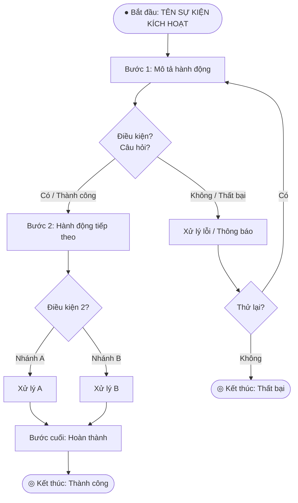

---

## 2.5. Ví Dụ — Quy Trình Duyệt Đơn Xin Việc

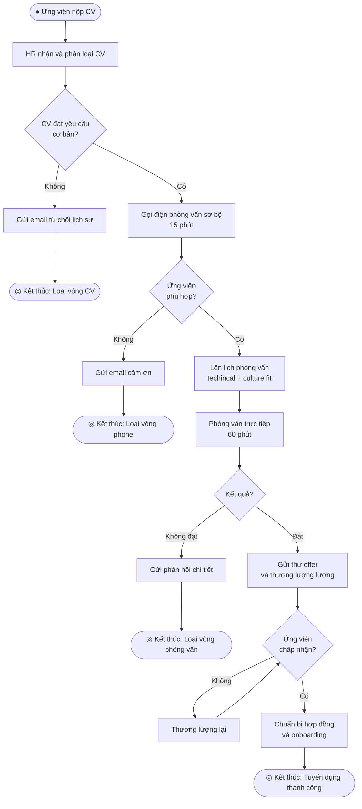

---

## 2.6. Lỗi Thường Gặp & Cách Tránh

| Lỗi | Vấn đề | Cách sửa |
|:----|:-------|:---------|
| Thiếu điểm kết thúc | Một nhánh không đến đâu | Mọi nhánh PHẢI có End Node |
| Decision > 2 nhánh không gắn nhãn | Không biết điều kiện nào | Gắn nhãn RÕ RÀNG mỗi nhánh |
| Quá nhiều bước nhỏ | Diagram rối | Gộp 3-4 bước nhỏ thành 1 Activity |
| Vòng lặp vô tận | Không có điều kiện thoát | Luôn thêm nhánh "Bỏ qua / Hủy" |
| Happy path thiếu exception | Diagram quá đơn giản | Luôn hỏi "Nếu lỗi thì sao?" |

---

# PHẦN 3: SWIMLANE DIAGRAM — "AI CHỊU TRÁCH NHIỆM TỪNG BƯỚC?"

## 3.1. Định Nghĩa & Mục Đích

Swimlane (Sơ đồ làn bơi) là Flowchart được chia theo **vai trò chịu trách nhiệm**. Mỗi "làn" = một người/bộ phận/hệ thống. Trả lời: **"Bước này do AI làm?"**

**Khi nào vẽ:**
- Quy trình có nhiều bộ phận tham gia
- Cần làm rõ trách nhiệm & bàn giao (handoff)
- Phân tích bottleneck (nút thắt cổ chai)

---

## 3.2. Công Thức Vẽ Swimlane (5 Bước)

```
BƯỚC 1: XÁC ĐỊNH CÁC "LÀN"
─────────────────────────────
Hỏi: "Có bao nhiêu vai trò khác nhau tham gia quy trình này?"
- Mỗi vai trò = 1 làn (lane)
- Thường có 3-6 làn là hợp lý
- Ít nhất: Actor chính + Hệ thống + DB
- Nhiều nhất: Chia theo phòng ban / microservice

Ví dụ làn phổ biến:
  • Người dùng / Khách hàng
  • Giao diện (Frontend)
  • Xử lý (Backend / API)
  • Cơ sở dữ liệu
  • Hệ thống bên ngoài (Stripe, Email...)
  • Bộ phận nội bộ (Kho, Kế toán, QA...)

BƯỚC 2: VẼ QUY TRÌNH TRƯỚC (KHÔNG CÓ LÀN)
────────────────────────────────────────────
- Trước tiên liệt kê tất cả các bước theo thứ tự
- Không cần lo về ai làm — cứ liệt kê hết

BƯỚC 3: GÁN TỪNG BƯỚC VÀO LÀN ĐÚNG
────────────────────────────────────────
- Đặt mỗi bước vào làn của vai trò thực hiện bước đó
- Khi bước chuyển từ làn này sang làn kia = điểm HANDOFF (bàn giao)

BƯỚC 4: VẼ MŨI TÊN KẾT NỐI
──────────────────────────────
- Kết nối các bước theo thứ tự
- Mũi tên cắt qua ranh giới làn = thấy rõ điểm giao tiếp

BƯỚC 5: PHÂN TÍCH HANDOFF
───────────────────────────
- Đếm số lần bàn giao giữa các làn
- Nhiều handoff = nhiều rủi ro delay / lỗi
- Có thể tối ưu bằng cách gộp bước hoặc tự động hóa
```

---

## 3.3. Template Swimlane (Copy & Chỉnh Sửa)

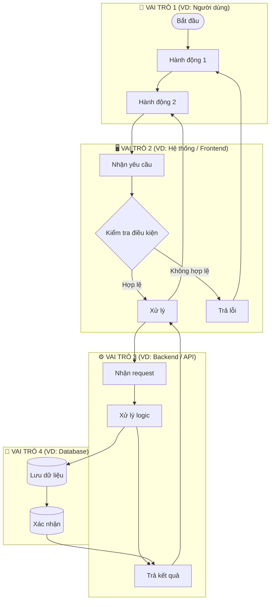

---

## 3.4. Bảng RACI — Công Cụ Bổ Sung Cho Swimlane

> **RACI** = Responsible (Thực hiện) / Accountable (Chịu trách nhiệm) / Consulted (Tham vấn) / Informed (Được thông báo)

**Template RACI:**

| Hoạt động | Vai trò A | Vai trò B | Vai trò C | Vai trò D |
|:----------|:----------|:----------|:----------|:----------|
| Bước 1    | **R**     | A         | C         | I         |
| Bước 2    | I         | **R/A**   | -         | I         |
| Bước 3    | -         | A         | **R**     | I         |

**Quy tắc RACI:**
- Mỗi hàng CHỈ có đúng 1 **A** (người chịu trách nhiệm cuối cùng)
- Có thể có nhiều **R** (nhiều người cùng thực hiện)
- **C** = hỏi ý kiến TRƯỚC khi làm
- **I** = thông báo SAU khi làm xong

---

# PHẦN 4: SEQUENCE DIAGRAM — "CÁC THÀNH PHẦN GIAO TIẾP THẾ NÀO?"

## 4.1. Định Nghĩa & Mục Đích

Sequence Diagram mô tả **thứ tự các tin nhắn** được gửi qua lại giữa các thành phần theo **trục thời gian** (từ trên xuống dưới). Trả lời: **"Khi thực hiện chức năng X, tin nhắn đi qua những đâu, theo thứ tự nào?"**

**Khi nào vẽ:**
- Mô tả API interaction chi tiết
- Làm rõ luồng xác thực (auth flow)
- Debug / phân tích một feature phức tạp
- Tài liệu cho Developer

---

## 4.2. Các Ký Hiệu Cần Biết

| Ký hiệu | Tên | Ý nghĩa |
|:--------|:----|:--------|
| `[hộp trên]` | Participant / Actor | Thành phần tham gia |
| `│` | Lifeline | Đường thời gian của mỗi thành phần |
| `──────>` | Synchronous Message | Gửi tin nhắn & CHỜ phản hồi |
| `- - - ->` | Return Message | Tin nhắn phản hồi (return) |
| `──────>>` | Asynchronous | Gửi tin nhắn & KHÔNG chờ |
| `alt / else` | Alternative | Nhánh điều kiện (if/else) |
| `loop` | Loop | Lặp lại |
| `opt` | Optional | Tùy chọn — chỉ xảy ra khi có điều kiện |
| `par` | Parallel | Xảy ra song song |
| `Note` | Note | Ghi chú giải thích |

---

## 4.3. Công Thức Vẽ Sequence Diagram (6 Bước)

```
BƯỚC 1: XÁC ĐỊNH PARTICIPANTS
───────────────────────────────
Hỏi: "Những thành phần nào tham gia vào chức năng này?"

Danh sách participants thường gặp:
  • User / Actor (người kích hoạt)
  • Browser / Mobile App (giao diện)
  • API Gateway / Backend
  • Database (DB)
  • Cache (Redis...)
  • External Service (Stripe, SMS, Email...)
  • Authentication Service

Sắp xếp từ TRÁI sang PHẢI theo chiều luồng:
User → UI → API → DB → External

BƯỚC 2: XÁC ĐỊNH TRIGGER (ĐIỂM BẮT ĐẦU)
──────────────────────────────────────────
- Hành động đầu tiên là gì?
- Ai thực hiện? (thường là User hoặc System)

BƯỚC 3: VẼ HAPPY PATH (LUỒNG BÌNH THƯỜNG)
────────────────────────────────────────────
- Liệt kê từng bước theo thứ tự thời gian
- Mỗi tin nhắn = 1 mũi tên nằm ngang
- Gắn số thứ tự (1, 2, 3...) để dễ theo dõi
- Tin nhắn đi = ──────>, phản hồi = - - - ->

BƯỚC 4: THÊM CÁC TRƯỜNG HỢP ĐẶC BIỆT
────────────────────────────────────────
- Dùng alt/else cho các nhánh điều kiện
- Dùng loop khi có vòng lặp
- Dùng opt khi có bước tùy chọn

BƯỚC 5: THÊM GHI CHÚ (NOTE)
──────────────────────────────
- Giải thích các bước phức tạp
- Ghi rõ HTTP method + status code (POST /api/v1/... → 200 OK)
- Ghi timeout, retry policy nếu có

BƯỚC 6: KIỂM TRA
──────────────────
- Mỗi synchronous message phải có return message
- Số bước không quá 20 (nếu hơn → tách thành nhiều diagram)
- Sequence phải khớp với API spec thực tế
```

---

## 4.4. Template Sequence Diagram (Copy & Chỉnh Sửa)

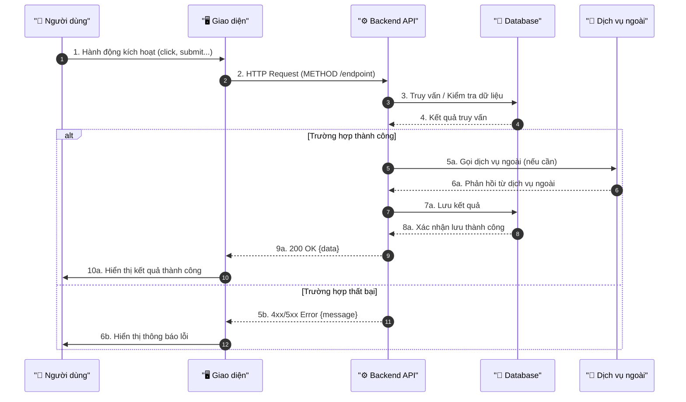

---

## 4.5. Ví Dụ — Sequence: Đăng Nhập Hệ Thống

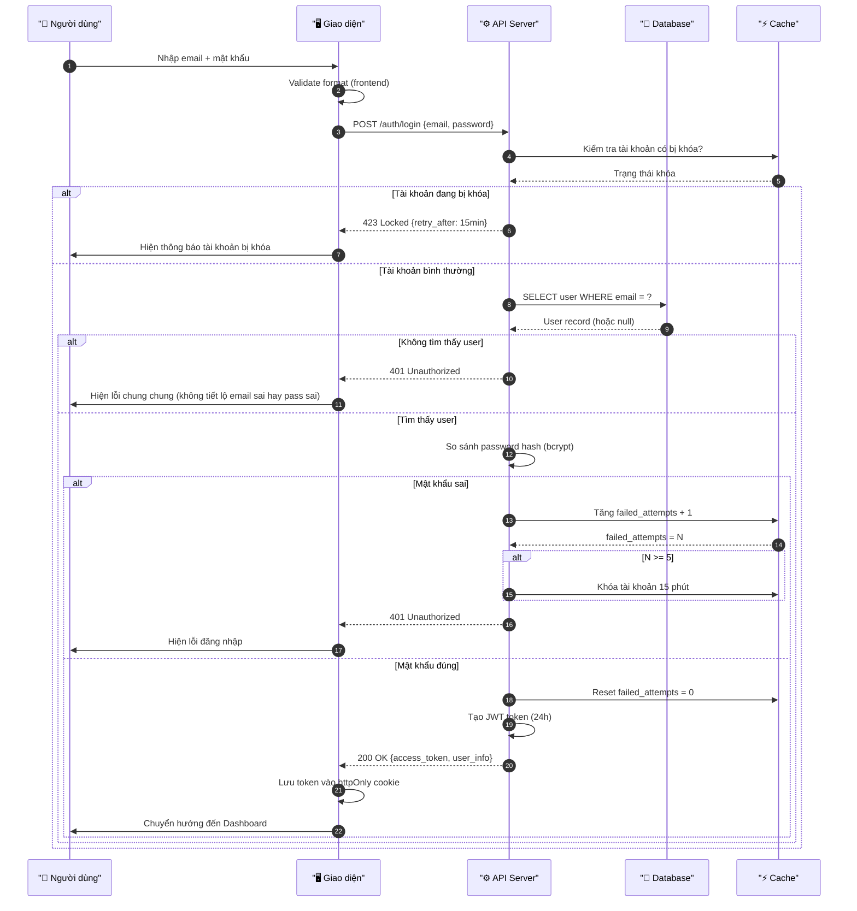

---

## 4.6. Lỗi Thường Gặp & Cách Tránh

| Lỗi | Vấn đề | Cách sửa |
|:----|:-------|:---------|
| Quá nhiều participants | Diagram chật, khó đọc | Tối đa 6-7 participants; tách diagram nếu nhiều hơn |
| Thiếu return message | Đường một chiều, không rõ kết quả | Mỗi request đồng bộ PHẢI có response |
| Không đánh số | Khó theo dõi thứ tự | Luôn dùng autonumber |
| Không xử lý lỗi | Chỉ có happy path | Luôn thêm alt/else cho error case |
| Quá chi tiết | Mô tả từng dòng code | Diagram là thiết kế, không phải code |

---

# PHẦN 5: ERD — "DỮ LIỆU ĐƯỢC LƯU NHƯ THẾ NÀO?"

## 5.1. Định Nghĩa & Mục Đích

ERD (Entity-Relationship Diagram) mô tả **cấu trúc dữ liệu** của hệ thống: có những "bảng" nào, mỗi bảng có những "cột" gì, và các bảng liên quan với nhau thế nào.

**Khi nào vẽ:**
- Thiết kế database trước khi code
- Làm tài liệu hóa database hiện có
- Phân tích yêu cầu dữ liệu từ business

---

## 5.2. Các Ký Hiệu Quan Trọng

| Ký hiệu | Ý nghĩa |
|:--------|:--------|
| **PK** | Primary Key — định danh duy nhất của một bản ghi |
| **FK** | Foreign Key — khóa ngoại, liên kết sang bảng khác |
| **NK** | Natural Key — khóa tự nhiên (mã code, email...) |
| `\|\|` | Đúng một (exactly one) — bắt buộc |
| `\|o` | Không hoặc một (zero or one) — tùy chọn |
| `\|{` | Một hoặc nhiều (one or many) — bắt buộc có ít nhất 1 |
| `o{` | Không hoặc nhiều (zero or many) — tùy chọn |

### Đọc Quan Hệ:

```
USER ||--o{ ORDER : "đặt"
Đọc: Một USER đặt không hoặc nhiều ORDER
     Mỗi ORDER thuộc đúng một USER

PRODUCT ||--|{ ORDER_ITEM : "có trong"
Đọc: Một PRODUCT có trong một hoặc nhiều ORDER_ITEM (bắt buộc)
     Mỗi ORDER_ITEM chứa đúng một PRODUCT
```

---

## 5.3. Công Thức Vẽ ERD (7 Bước)

```
BƯỚC 1: XÁC ĐỊNH CÁC THỰC THỂ (ENTITIES)
──────────────────────────────────────────
Hỏi: "Hệ thống cần lưu trữ thông tin về những ĐỐI TƯỢNG nào?"
- Danh từ quan trọng trong yêu cầu = có thể là Entity
- Ví dụ: Người dùng, Sản phẩm, Đơn hàng, Phòng, Nhân viên...
- Mỗi entity sẽ thành một bảng trong DB

BƯỚC 2: XÁC ĐỊNH THUỘC TÍNH (ATTRIBUTES)
──────────────────────────────────────────
Hỏi: "Cần lưu thông tin GÌ về đối tượng này?"
- Mỗi thuộc tính = một cột trong bảng
- Xác định kiểu dữ liệu: string, int, decimal, datetime, boolean...
- Phân biệt: Bắt buộc (NOT NULL) vs Tùy chọn (NULL)

BƯỚC 3: XÁC ĐỊNH KHÓA CHÍNH (PRIMARY KEY)
────────────────────────────────────────────
- Mỗi entity cần 1 PK duy nhất
- Nên dùng: UUID hoặc SERIAL/AUTO_INCREMENT
- Không dùng thông tin có thể thay đổi làm PK (email, phone)

BƯỚC 4: XÁC ĐỊNH QUAN HỆ GIỮA CÁC ENTITY
────────────────────────────────────────────
Hỏi cho mỗi cặp entity:
  "1 [A] liên quan đến bao nhiêu [B]?"
  "1 [B] liên quan đến bao nhiêu [A]?"

3 loại quan hệ:
  • 1-1: Một người có đúng 1 hộ chiếu
  • 1-N: Một người có nhiều đơn hàng
  • M-N: Nhiều sinh viên học nhiều môn học (cần bảng trung gian!)

BƯỚC 5: XỬ LÝ QUAN HỆ M-N
────────────────────────────
- Không vẽ M-N trực tiếp → cần tạo bảng TRUNG GIAN (junction table)
- Bảng trung gian có 2 FK + có thể có thuộc tính riêng

Ví dụ:
  STUDENT (M) ──── ENROLLMENT ──── (N) COURSE
  ENROLLMENT có: student_id (FK), course_id (FK), enrolled_date, grade

BƯỚC 6: THÊM KHÓA NGOẠI (FOREIGN KEY)
────────────────────────────────────────
- Phía "nhiều" (N) giữ FK trỏ về phía "một" (1)
- Ví dụ: ORDER có user_id FK → USER.id

BƯỚC 7: REVIEW VỚI DBA / DEVELOPER
────────────────────────────────────
- Có thiếu entity nào không?
- Có thuộc tính nào chưa chuẩn hóa (normalization)?
- Index cần thiết ở đâu? (cột hay tìm kiếm)
```

---

## 5.4. Template ERD (Copy & Chỉnh Sửa)

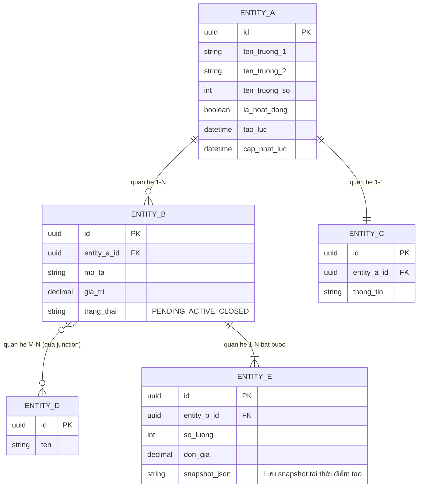

---

## 5.5. Checklist Thuộc Tính Cần Có Cho Mỗi Entity

```
Thuộc tính BẮT BUỘC (gần như luôn cần):
  ✅ id          — UUID hoặc SERIAL, Primary Key
  ✅ created_at  — Thời điểm tạo bản ghi
  ✅ updated_at  — Thời điểm cập nhật cuối

Thuộc tính NÊN CÓ:
  ✅ is_active / is_deleted — Soft delete (không xóa cứng)
  ✅ created_by / updated_by — Ai tạo/sửa (audit trail)
  ✅ version — Optimistic locking (tránh conflict)

Thuộc tính TRÁNH:
  ❌ password (lưu thẳng) → Luôn lưu password_hash
  ❌ Dữ liệu thẻ ngân hàng → Vi phạm PCI DSS
  ❌ Dữ liệu quan hệ lưu trong 1 cột dạng string → Vi phạm normalization
```

---

## 5.6. Lỗi Thường Gặp & Cách Tránh

| Lỗi | Vấn đề | Cách sửa |
|:----|:-------|:---------|
| Dùng email làm PK | Email có thể thay đổi | Dùng UUID/SERIAL làm PK |
| Không tách M-N | DB không hỗ trợ trực tiếp | Tạo junction table |
| Thuộc tính computed | Lưu "tuổi" thay vì "ngày sinh" | Lưu raw data, tính khi cần |
| Thiếu audit fields | Không biết ai làm gì khi nào | Luôn thêm created_at, updated_at |
| Over-normalize | Quá nhiều JOIN, chậm | Đôi khi denormalize có chủ đích |

---

# PHẦN 6: STATE MACHINE DIAGRAM — "TRẠNG THÁI THAY ĐỔI THẾ NÀO?"

## 6.1. Định Nghĩa & Mục Đích

State Machine (Sơ đồ trạng thái) mô tả **một đối tượng trải qua những trạng thái nào** và **điều kiện gì khiến nó chuyển trạng thái**. Trả lời: **"Đối tượng X có thể ở những trạng thái nào? Chuyển sang trạng thái khác khi nào?"**

**Khi nào vẽ:**
- Entity có nhiều trạng thái vòng đời (lifecycle)
- Cần làm rõ quy tắc chuyển trạng thái
- Phổ biến: Order, Ticket, User account, Payment, Document...

---

## 6.2. Công Thức Vẽ State Machine (5 Bước)

```
BƯỚC 1: XÁC ĐỊNH ĐỐI TƯỢNG
────────────────────────────
- Chọn 1 entity có trạng thái thay đổi theo thời gian
- Ví dụ: Đơn hàng, Vé hỗ trợ, Tài khoản, Hồ sơ xin việc...

BƯỚC 2: LIỆT KÊ TẤT CẢ TRẠNG THÁI
─────────────────────────────────────
Hỏi: "Đối tượng này có thể đang ở trạng thái nào?"
- Đặt tên trạng thái bằng DANH TỪ hoặc TÍNH TỪ (không phải động từ)
- Dùng chữ HOA: PENDING, ACTIVE, CANCELLED...
- Xác định: Trạng thái ban đầu (Initial) và trạng thái kết thúc (Final)

BƯỚC 3: XÁC ĐỊNH CHUYỂN TRẠNG THÁI (TRANSITIONS)
────────────────────────────────────────────────────
Cho mỗi trạng thái, hỏi:
  "Sự kiện nào khiến đối tượng RỜI KHỎI trạng thái này?"
  "Đi đến trạng thái nào?"
  "Điều kiện nào phải thỏa mãn?"

Format: [Trạng thái A] --[Sự kiện / Điều kiện]--> [Trạng thái B]

BƯỚC 4: XỬ LÝ TRƯỜNG HỢP ĐẶC BIỆT
────────────────────────────────────
- Trạng thái nào có thể bị HỦY? (CANCELLED)
- Có trạng thái CUỐI không thể chuyển tiếp? (terminal state)
- Có thể quay lại trạng thái trước? (rollback)

BƯỚC 5: GẮN ACTIONS VÀO TRANSITIONS (nếu cần)
────────────────────────────────────────────────
- Mỗi khi chuyển trạng thái, hệ thống làm gì?
- Ví dụ: PENDING → PAID: "Gửi email xác nhận + Cập nhật tồn kho"
```

---

## 6.3. Template State Machine (Copy & Chỉnh Sửa)

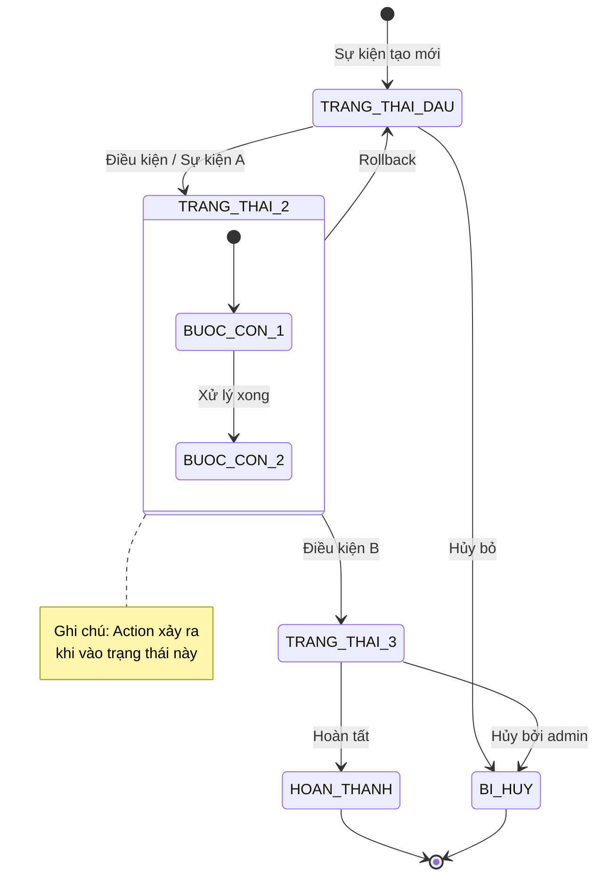

---

## 6.4. Ví Dụ — Vòng Đời Ticket Hỗ Trợ Khách Hàng

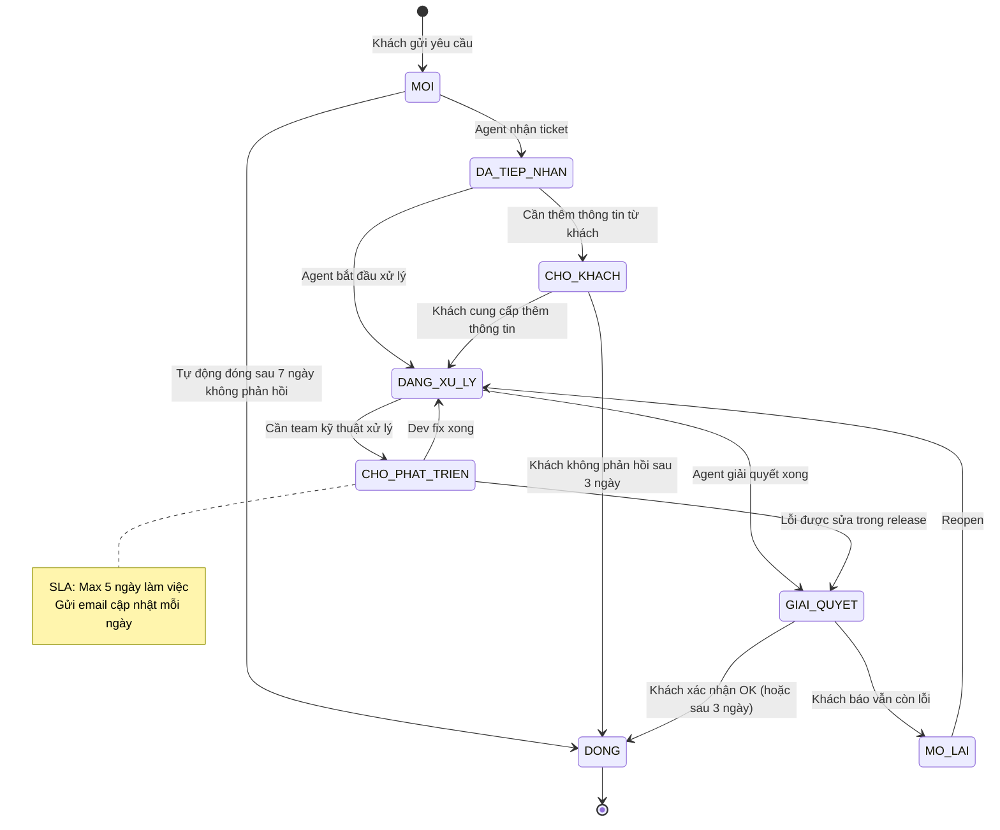

---

## 6.5. Checklist Trạng Thái Phổ Biến Theo Domain

```
ĐƠN HÀNG (Order):
  DRAFT → PENDING → CONFIRMED → PROCESSING
  → SHIPPED → DELIVERED → COMPLETED
  Nhánh: CANCELLED, RETURNED, REFUNDED

VÉ HỖ TRỢ (Support Ticket):
  NEW → IN_PROGRESS → PENDING_CUSTOMER
  → RESOLVED → CLOSED
  Nhánh: REOPENED, ESCALATED

TÀI KHOẢN NGƯỜI DÙNG (User Account):
  PENDING_VERIFICATION → ACTIVE
  → SUSPENDED → DEACTIVATED
  Nhánh: LOCKED (đăng nhập sai nhiều lần)

HỒ SƠ XIN VIỆC (Job Application):
  SUBMITTED → SCREENING → INTERVIEW
  → OFFER → HIRED
  Nhánh: REJECTED (ở mỗi giai đoạn), WITHDRAWN

TÀI LIỆU (Document):
  DRAFT → IN_REVIEW → APPROVED → PUBLISHED
  Nhánh: REJECTED, ARCHIVED

THANH TOÁN (Payment):
  INITIATED → PROCESSING → SUCCESS
  Nhánh: FAILED, REFUNDED, DISPUTED
```

---

# PHẦN 7: ARCHITECTURE DIAGRAM — "HỆ THỐNG GỒM NHỮNG TẦNG NÀO?"

## 7.1. Định Nghĩa & Mục Đích

Architecture Diagram mô tả **cấu trúc tổng thể** của hệ thống: các tầng (layers), thành phần (components), và cách chúng kết nối. Trả lời: **"Hệ thống được xây dựng từ những khối nào?"**

**Khi nào vẽ:** Trình bày cho stakeholder kỹ thuật, lựa chọn tech stack, onboard developer mới.

---

## 7.2. Công Thức Vẽ Architecture Diagram (5 Bước)

```
BƯỚC 1: CHỌN KIỂU KIẾN TRÚC
──────────────────────────────
Các kiểu phổ biến:
  • 3-Layer (Client – Server – Database): Web app thông thường
  • Microservices: Hệ thống lớn, nhiều team
  • Event-Driven: Hệ thống bất đồng bộ, queue
  • Serverless: Cloud functions

BƯỚC 2: XÁC ĐỊNH CÁC TẦNG (LAYERS)
──────────────────────────────────────
Tầng chuẩn cho web app:
  Layer 1: Client (Browser, Mobile App, Desktop)
  Layer 2: CDN / Edge (Cloudflare, CloudFront)
  Layer 3: API Gateway / Load Balancer
  Layer 4: Application Services (Backend)
  Layer 5: Data Layer (DB, Cache, Storage)
  Layer 6: External Services (3rd party APIs)

BƯỚC 3: LIỆT KÊ COMPONENTS TRONG TỪNG TẦNG
─────────────────────────────────────────────
Mỗi tầng có những thành phần cụ thể gì?
  Ví dụ Layer 4 (Application):
    - Auth Service
    - Product Service
    - Order Service
    - Notification Service

BƯỚC 4: VẼ KẾT NỐI GIỮA COMPONENTS
────────────────────────────────────
  - Kết nối xuôi chiều (request/response)
  - Giao thức: HTTPS, gRPC, AMQP, WebSocket...
  - Chú thích loại kết nối nếu cần

BƯỚC 5: THÊM DEPLOYMENT INFO
──────────────────────────────
  Mỗi component chạy ở đâu?
  - Vercel, Netlify (Frontend)
  - Railway, Heroku, AWS EC2 (Backend)
  - Supabase, PlanetScale, RDS (Database)
  - Redis Cloud, Upstash (Cache)
```

---

## 7.3. Template Architecture Diagram

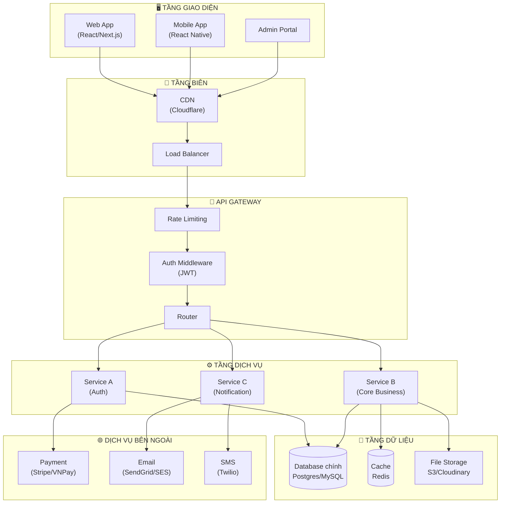

---

# PHẦN 8: DATA FLOW DIAGRAM (DFD) — "DỮ LIỆU CHẠY QUA ĐÂU?"

## 8.1. Định Nghĩa & Mục Đích

DFD mô tả **luồng dữ liệu**: dữ liệu đến từ đâu, đi qua những xử lý nào, được lưu ở đâu. Có 2 cấp: **Context Diagram (Level 0)** và **Level 1 DFD**.

---

## 8.2. Các Ký Hiệu DFD

| Ký hiệu | Tên | Ý nghĩa |
|:--------|:----|:--------|
| Hình tròn / oval | Process | Một bước xử lý dữ liệu |
| Hình chữ nhật | External Entity | Nguồn/đích dữ liệu bên ngoài |
| Hai đường ngang | Data Store | Nơi lưu trữ dữ liệu |
| Mũi tên có nhãn | Data Flow | Luồng dữ liệu + tên dữ liệu |

---

## 8.3. Công Thức Vẽ DFD (4 Bước)

```
BƯỚC 1: VẼ CONTEXT DIAGRAM (LEVEL 0)
──────────────────────────────────────
- 1 hình tròn ở giữa = toàn bộ hệ thống
- Các external entities xung quanh
- Mũi tên = dữ liệu vào/ra hệ thống
- Mục đích: Xác định PHẠM VI và GIAO DIỆN hệ thống

BƯỚC 2: PHÂN RÃ THÀNH LEVEL 1
────────────────────────────────
- Chia hệ thống thành 3-7 processes chính
- Thêm data stores (nơi lưu dữ liệu)
- Kết nối bằng data flows có nhãn

BƯỚC 3: GẮN NHÃN CHO MỌI MŨI TÊN
────────────────────────────────────
- Mỗi mũi tên PHẢI có tên dữ liệu
- Ví dụ: "Thông tin đơn hàng", "JWT Token", "Kết quả thanh toán"

BƯỚC 4: KIỂM TRA CÂN BẰNG
────────────────────────────
- Data vào process = Data ra process (cân bằng)
- Không có "black hole" (process chỉ nhận, không trả)
- Không có "miracle" (process chỉ trả, không nhận)
```

---

## 8.4. Template DFD Level 0 (Context Diagram)

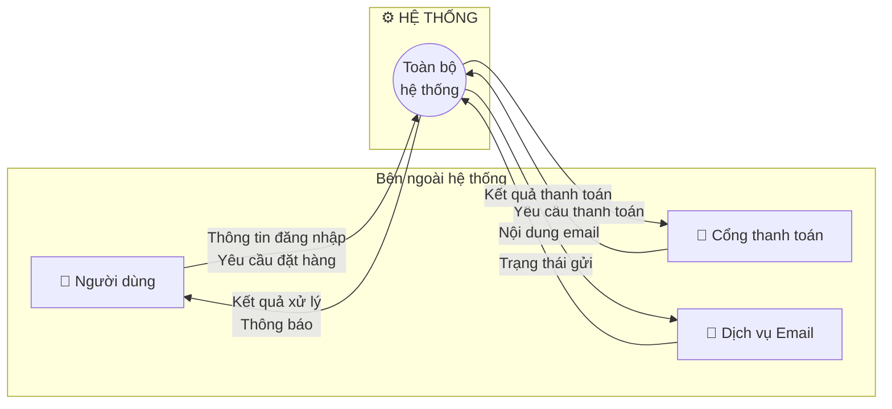

---

# PHẦN 9: SITEMAP & USER FLOW — "CẤU TRÚC TRANG & HÀNH TRÌNH NGƯỜI DÙNG?"

## 9.1. Sitemap

**Mục đích:** Cho thấy **tất cả các trang/màn hình** của hệ thống và mối quan hệ phân cấp.

```
CÔNG THỨC VẼ SITEMAP:

BƯỚC 1: Liệt kê tất cả màn hình/trang
  Hỏi: "Người dùng có thể đến trang/màn hình nào?"

BƯỚC 2: Phân cấp theo navigation
  - Trang chủ / Dashboard là gốc
  - Các section chính là cấp 2
  - Các trang con là cấp 3

BƯỚC 3: Đánh dấu quyền truy cập
  - Công khai (không cần đăng nhập)
  - Riêng tư (cần đăng nhập)
  - Chỉ Admin
```

**Template Sitemap:**

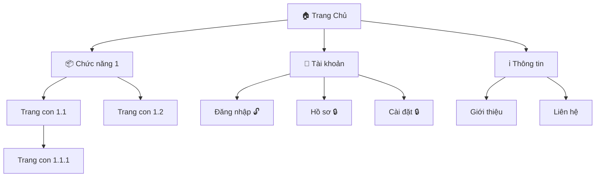

---

## 9.2. User Flow

**Mục đích:** Mô tả **hành trình của người dùng** qua các màn hình để hoàn thành một mục tiêu.

```
CÔNG THỨC VẼ USER FLOW:

BƯỚC 1: Xác định mục tiêu
  "Người dùng muốn đạt được gì?"
  Ví dụ: Mua hàng, Đặt lịch, Gửi yêu cầu...

BƯỚC 2: Xác định điểm vào (Entry Point)
  Họ bắt đầu từ đâu? Email? Google Search? App?

BƯỚC 3: Vẽ từng màn hình theo thứ tự
  Mỗi ô = 1 màn hình
  Mũi tên = hành động chuyển màn hình

BƯỚC 4: Xử lý điểm rẽ nhánh
  Khi có điều kiện (đã đăng nhập chưa? Có hàng không?)
  → Vẽ hình thoi Decision

BƯỚC 5: Xác định điểm kết thúc
  Có thể nhiều kết thúc: Thành công / Thất bại / Thoát giữa chừng
```

---

# PHẦN 10: WIREFRAME — "GIAO DIỆN TRÔNG NHƯ THẾ NÀO?"

## 10.1. Định Nghĩa & Mục Đích

Wireframe là **bản phác thảo bố cục giao diện** — cho thấy thứ gì nằm ở đâu trên màn hình, KHÔNG có màu sắc hay thiết kế cuối cùng.

**Khi nào vẽ:** Trước khi design, sau khi có User Flow, để align với PO và Designer.

---

## 10.2. Công Thức Vẽ Wireframe Text (ASCII) (5 Bước)

```
BƯỚC 1: XÁC ĐỊNH VÙNG BỐ CỤC CHÍNH
──────────────────────────────────────
Mọi trang đều có:
  - Header (Navigation bar)
  - Main Content (nội dung chính)
  - Footer (chân trang)

BƯỚC 2: PHÁC THẢO GRID / LAYOUT
──────────────────────────────────
Chọn kiểu layout:
  - Full-width: 1 cột
  - 2 cột: Sidebar + Content
  - 3 cột: Sidebar + Content + Panel phụ
  - Grid: 2x2, 3x3, 4x4...

BƯỚC 3: ĐẶT CÁC THÀNH PHẦN VÀO LAYOUT
────────────────────────────────────────
Các thành phần phổ biến:
  [TEXT] = Văn bản, tiêu đề
  [IMG]  = Ảnh, media
  [BTN]  = Nút bấm
  [FORM] = Form nhập liệu
  [LIST] = Danh sách
  [CARD] = Thẻ thông tin
  [NAV]  = Navigation menu
  [TAB]  = Tab chuyển mục

BƯỚC 4: GHI CHÚ HÀNH VI
─────────────────────────
  Thêm chú thích bên cạnh:
  "→ Click vào đây chuyển đến trang X"
  "→ Hiện khi hết hàng"
  "→ Disabled khi form chưa đủ"

BƯỚC 5: ANNOTATE (THÊM SỐ CHÚ THÍCH)
───────────────────────────────────────
  Đánh số ①②③ vào các thành phần
  Bên dưới giải thích từng số
```

---

## 10.3. Template Wireframe ASCII

```
Trang: [TÊN TRANG]
Mô tả: [Mục đích của trang này]

┌─────────────────────────────────────────────────────────┐
│  LOGO          [NAV: Mục 1] [Mục 2] [Mục 3]    [🔍][👤]│  ← Header
├─────────────────────────────────────────────────────────┤
│                                                         │
│  ┌─────────────────────────────────────────────────┐   │  ← Hero / Banner
│  │                                                 │   │
│  │   [TIÊU ĐỀ CHÍNH - H1]                         │   │
│  │   [Mô tả ngắn]                                  │   │
│  │   [BTN: Call to Action]                         │   │
│  │                                                 │   │
│  └─────────────────────────────────────────────────┘   │
│                                                         │
│  ── Khu vực nội dung ────────────────────────────────  │
│  ┌──────────┐  ┌──────────┐  ┌──────────┐             │  ← Grid 3 cột
│  │  [IMG]   │  │  [IMG]   │  │  [IMG]   │             │
│  │ [Tiêu đề]│  │ [Tiêu đề]│  │ [Tiêu đề]│             │
│  │ [Mô tả]  │  │ [Mô tả]  │  │ [Mô tả]  │             │
│  │ [BTN]    │  │ [BTN]    │  │ [BTN]    │             │
│  └──────────┘  └──────────┘  └──────────┘             │
│                                                         │
│  ─ Sidebar ────┬─ Nội dung chính ───────────────────  │
│  [FILTER]      │  [LIST ITEM 1]                        │  ← Layout 2 cột
│  □ Option 1    │  [LIST ITEM 2]                        │
│  □ Option 2    │  [LIST ITEM 3]                        │
│  [BTN: Lọc]    │  [PAGINATION: ◀ 1 2 3 ▶]            │
│                │                                        │
├────────────────────────────────────────────────────────┤
│  © 2026 [Công ty]    [Link 1] [Link 2] [Link 3]        │  ← Footer
└─────────────────────────────────────────────────────────┘

CHÚ THÍCH:
① Header: Sticky (dính khi scroll), có cart badge
② Hero: Hình nền, text overlay, CTA button nổi bật
③ Grid: Responsive — 3 cột desktop, 2 cột tablet, 1 cột mobile
④ Sidebar: Collapse được trên mobile
⑤ Pagination: Hiện khi có > 12 items
```

---

# PHẦN 11: CHECKLIST & ANTI-PATTERNS — "KIỂM TRA TRƯỚC KHI NỘP"

## 11.1. Checklist Tổng Quát Cho Mọi Sơ Đồ

```
✅ TRƯỚC KHI VẼ
  □ Đã xác định rõ MỤC ĐÍCH của sơ đồ này?
  □ Đã biết ĐỐI TƯỢNG đọc là ai? (Dev, PO, Stakeholder, QA?)
  □ Đã có đủ thông tin để vẽ? (không đoán mò)

✅ TRONG KHI VẼ
  □ Tiêu đề rõ ràng (tên loại sơ đồ + tên chức năng)
  □ Chú giải đầy đủ (legend) nếu dùng màu/ký hiệu đặc biệt
  □ Gắn nhãn cho MỌI mũi tên quan trọng
  □ Font đủ lớn để đọc khi in
  □ Không quá 1 trang A4 (nếu không — tách diagram)

✅ SAU KHI VẼ
  □ Tự đọc lại từ góc nhìn người mới — có hiểu không?
  □ Nhờ 1 người khác review
  □ Đã align với code/API thực tế chưa?
  □ Đã cập nhật khi yêu cầu thay đổi chưa?
```

---

## 11.2. Bảng Chọn Sơ Đồ Theo Tình Huống

| Câu hỏi stakeholder hỏi | Sơ đồ nên dùng |
|:------------------------|:---------------|
| "Hệ thống làm được gì?" | Use Case Diagram |
| "Quy trình này chạy thế nào?" | Activity / Flowchart |
| "Ai làm bước nào?" | Swimlane |
| "Khi tôi click X, chuyện gì xảy ra phía sau?" | Sequence Diagram |
| "Dữ liệu được lưu thế nào?" | ERD |
| "Đơn hàng đang ở bước nào? Có thể hủy không?" | State Machine |
| "Hệ thống dùng công nghệ gì?" | Architecture Diagram |
| "Dữ liệu đi từ đâu đến đâu?" | DFD |
| "Website có bao nhiêu trang?" | Sitemap |
| "Người dùng đi qua những màn hình nào?" | User Flow |
| "Màn hình này trông như thế nào?" | Wireframe |

---

## 11.3. Anti-Patterns — Những Gì KHÔNG Nên Làm

| Anti-Pattern | Hậu quả | Cách tránh |
|:-------------|:--------|:-----------|
| "Diagram as Code" — vẽ quá chi tiết | Dev không cần BA nữa | Diagram là THIẾT KẾ, không phải implementation |
| "One diagram to rule them all" | 1 diagram quá lớn, không ai đọc | Tách theo scope, 1 diagram = 1 mục đích |
| Không cập nhật sau khi thay đổi | Diagram và code mâu thuẫn | Treat diagram như code — version control |
| Dùng ký hiệu tùy tiện | Người khác không hiểu | Theo chuẩn (UML, BPMN) hoặc có legend |
| Không có title/context | Không biết diagram này về cái gì | Luôn thêm tiêu đề + ngày + tác giả |
| Skip review với stakeholder | Vẽ sai yêu cầu | Review ít nhất 1 lần với người dùng cuối |
| Copy diagram từ dự án cũ | Thông tin sai | Luôn customize cho dự án hiện tại |

---

## 11.4. Thứ Tự Vẽ Sơ Đồ Theo Giai Đoạn Dự Án

```
GIAI ĐOẠN 1: KHỞI ĐẦU DỰ ÁN (Inception)
──────────────────────────────────────────
  Vẽ trước:
  1. Use Case Diagram → Xác định scope
  2. Context DFD → Xác định giao diện hệ thống
  3. Sitemap → Cấu trúc sản phẩm
  Mục đích: Đồng thuận với stakeholder

GIAI ĐOẠN 2: PHÂN TÍCH YÊU CẦU (Analysis)
────────────────────────────────────────────
  Vẽ tiếp:
  4. Activity / Flowchart → Chi tiết quy trình
  5. Swimlane → Phân công trách nhiệm
  6. State Machine → Vòng đời các entity
  Mục đích: Làm rõ nghiệp vụ cho team

GIAI ĐOẠN 3: THIẾT KẾ (Design)
────────────────────────────────
  Vẽ tiếp:
  7. ERD → Cấu trúc dữ liệu
  8. Architecture Diagram → Công nghệ & tầng
  9. Sequence Diagram → API interaction
  10. User Flow + Wireframe → Giao diện
  Mục đích: Tài liệu cho Developer bắt đầu code

GIAI ĐOẠN 4: PHÁT TRIỂN & KIỂM THỬ (Dev & QA)
──────────────────────────────────────────────────
  Cập nhật:
  - Giữ tất cả diagram đồng bộ với code
  - Thêm diagram mới nếu scope thay đổi
  - Dùng Sequence Diagram làm cơ sở viết test case
```

---

## 11.5. Mẫu Đặt Tên File Chuẩn

```
Format: [Loại_sơ_đồ]_[Tên_chức_năng]_v[Số phiên bản]

Ví dụ:
  usecase_tong_quan_he_thong_v1.md
  activity_quy_trinh_dat_hang_v2.md
  swimlane_xu_ly_don_hang_v1.md
  sequence_dang_nhap_v1.md
  erd_database_schema_v3.md
  state_vong_doi_don_hang_v1.md
  architecture_tong_quan_he_thong_v2.md
  wireframe_trang_checkout_v1.md
```

---

## 11.6. Bộ Câu Hỏi Khai Thác Yêu Cầu (Dùng Cho Mọi Dự Án)

```
NHÓM CÂU HỎI VỀ NGƯỜI DÙNG:
  □ Ai là người dùng chính? Họ có đặc điểm gì?
  □ Người dùng muốn đạt được mục tiêu gì?
  □ Hiện tại họ giải quyết vấn đề này bằng cách nào?
  □ Điều gì khiến họ thất vọng với cách hiện tại?

NHÓM CÂU HỎI VỀ CHỨC NĂNG:
  □ Hệ thống PHẢI làm gì? (Must have)
  □ Hệ thống NÊN làm gì? (Should have)
  □ Hệ thống KHÔNG làm gì? (Out of scope)
  □ Trường hợp ngoại lệ nào cần xử lý?
  □ Khi lỗi xảy ra, hệ thống phản ứng thế nào?

NHÓM CÂU HỎI VỀ DỮ LIỆU:
  □ Hệ thống cần lưu trữ thông tin gì?
  □ Dữ liệu đến từ đâu? Đi đến đâu?
  □ Ai được xem dữ liệu nào? (phân quyền)
  □ Dữ liệu cũ xử lý thế nào? (archive, delete?)
  □ Có dữ liệu nhạy cảm cần bảo vệ đặc biệt?

NHÓM CÂU HỎI VỀ QUY TRÌNH:
  □ Quy trình bắt đầu khi nào? Kết thúc khi nào?
  □ Ai phê duyệt? Điều kiện phê duyệt là gì?
  □ Có SLA / deadline không? (trong bao lâu phải xong)
  □ Quy trình có thể bị hủy/dừng không? Ai có quyền?

NHÓM CÂU HỎI VỀ KỸ THUẬT:
  □ Hệ thống phải đáp ứng bao nhiêu người dùng đồng thời?
  □ Yêu cầu về bảo mật? (2FA, encryption, audit log...)
  □ Tích hợp với hệ thống nào khác?
  □ Nền tảng: Web, Mobile, Desktop, hay tất cả?
```

---

# PHỤ LỤC: TỪ ĐIỂN THUẬT NGỮ BA

| Thuật ngữ | Tiếng Việt | Định nghĩa ngắn |
|:----------|:-----------|:----------------|
| Actor | Tác nhân | Người/hệ thống tương tác với hệ thống đang phân tích |
| Use Case | Ca sử dụng | Một mục tiêu hoàn chỉnh mà actor muốn đạt được |
| Activity | Hoạt động | Một bước trong quy trình |
| Swimlane | Làn bơi | Phân vùng quy trình theo trách nhiệm |
| Sequence | Tuần tự | Thứ tự các tin nhắn theo thời gian |
| Entity | Thực thể | Đối tượng cần lưu trữ dữ liệu |
| Attribute | Thuộc tính | Thông tin của một thực thể |
| Relation | Quan hệ | Liên kết giữa các thực thể |
| State | Trạng thái | Điều kiện tồn tại của một đối tượng tại thời điểm cụ thể |
| Transition | Chuyển trạng thái | Sự thay đổi từ trạng thái này sang trạng thái khác |
| Layer | Tầng | Nhóm các thành phần có cùng vai trò trong kiến trúc |
| Stakeholder | Bên liên quan | Người có quyền lợi liên quan đến dự án |
| Happy Path | Luồng thành công | Kịch bản lý tưởng khi mọi thứ hoạt động đúng |
| Edge Case | Trường hợp biên | Tình huống bất thường, giới hạn cần xử lý |
| Handoff | Bàn giao | Điểm chuyển giao trách nhiệm giữa các vai trò |
| Trigger | Kích hoạt | Sự kiện khởi đầu một quy trình |
| Scope | Phạm vi | Ranh giới những gì hệ thống sẽ làm |
| CRUD | Tạo/Đọc/Sửa/Xóa | 4 thao tác cơ bản trên dữ liệu |
| API | Giao diện lập trình | Cách các hệ thống giao tiếp với nhau |
| SLA | Thỏa thuận mức dịch vụ | Cam kết về thời gian/chất lượng dịch vụ |
| MVP | Sản phẩm khả thi tối thiểu | Phiên bản đầu tiên với tính năng cốt lõi |
| RACI | Ma trận phân công | Responsible/Accountable/Consulted/Informed |
| PK | Khóa chính | Định danh duy nhất của một bản ghi |
| FK | Khóa ngoại | Tham chiếu đến PK của bảng khác |
| ERD | Sơ đồ thực thể quan hệ | Entity-Relationship Diagram |
| DFD | Sơ đồ luồng dữ liệu | Data Flow Diagram |

---

*Bộ tài liệu này được thiết kế để dùng được với MỌI dự án.*  
*Cập nhật thường xuyên khi có phương pháp mới.*
